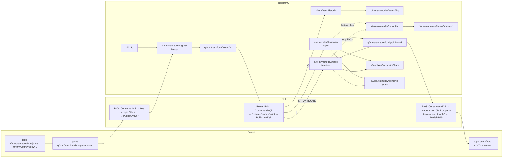

# Bridge

Bridge chuyển message giữa Solace (Internal EMS) và RabbitMQ (External EMS) theo cả hai chiều, theo mô hình EMS của VATM trong `docs/Documents/SWIM_APAC_Giai_thich_EMS_v4.docx` và `docs/Documents/SWIM_APAC_Cau_hinh_EMS_v4.xlsx`: **header ở biên, topic bên trong**. Mỗi chiều đi được theo hai cách định tuyến:

- **Topic routing** (Pub/Sub, topic `t/...`): message đi theo tên topic. Trên RabbitMQ là binding của topic exchange, trên Solace là subscription.
- **Header routing** (Request/Reply, topic `tr/...`): message đi theo header `APAC_RECIPIENT_LIST`. Trên RabbitMQ, Router tách danh sách này thành từng bản sao có header `VV_ROUTE`, rồi headers exchange chọn queue theo `VV_ROUTE` + `APAC_CATEGORY`. Trên Solace, người nhận lọc bằng selector trên `APAC_RECIPIENT_LIST`.

Các thuật ngữ được định nghĩa trong `CONTEXT.md`.

Bridge là một flow Apache NiFi (`nifi/bridge-flow.json`), chạy bằng image chính thức `docker.io/apache/nifi:2.12.0`. Không có code để build. Lý do chọn cách này nằm ở `docs/adr/0004-apache-nifi-replaces-camel.md`.

Đây là bản **thử nghiệm**, mọi object dùng token môi trường `dev`. Bridge chỉ dùng object mới tạo ở bước 1, không sửa object hay cấu hình nào đang có trên hai broker.

Các lệnh dưới đây dùng `podman`. Nếu dùng Docker, thay `podman` bằng `docker`, mọi thứ khác giữ nguyên.

## 1. Tạo object trên hai broker (một lần)

NiFi không tự tạo exchange hay queue. Tạo các object dưới đây bằng tay. Tất cả đều là object mới, không sửa object nào đang có.

### RabbitMQ

Mở RabbitMQ UI `http://192.168.121.61:15672`, làm trong vhost `swim_sg`. Mọi exchange đều `Durable`; mọi queue đều Type `Classic`, Durability `Durable`.

Exchanges → **Add a new exchange**, tạo theo đúng thứ tự (hai exchange `unrouted` và `dlx` phải có trước):

| Name | Type | Arguments |
|---|---|---|
| `x/vnm/vatm/dev/unrouted` | `fanout` | |
| `x/vnm/vatm/dev/dlx` | `fanout` | |
| `x/vnm/vatm/dev/ingress` | `fanout` | |
| `x/vnm/vatm/dev/swim` | `topic` | `alternate-exchange` = `x/vnm/vatm/dev/unrouted` |
| `x/vnm/vatm/dev/route` | `headers` | `alternate-exchange` = `x/vnm/vatm/dev/unrouted` |

`alternate-exchange` gõ ở ô Arguments (hoặc bấm link **Alternate exchange** bên dưới ô đó). Nhờ nó, message không khớp binding nào rơi vào `unrouted` thay vì bị RabbitMQ bỏ.

Queues and Streams → **Add a new queue**, rồi mở từng queue → **Bindings** → **Add binding to this queue**:

| Queue | From exchange | Routing key | Arguments | Dùng cho |
|---|---|---|---|---|
| `q/vnm/vatm/dev/router/in` | `x/vnm/vatm/dev/ingress` | | | Router đọc mọi message vào |
| `q/vnm/vatm/dev/bridge/inbound` | `x/vnm/vatm/dev/swim` | `t.vnm.acv.dev.#` | | Bridge đưa sang Solace (topic) |
| | `x/vnm/vatm/dev/route` | | `x-match` = `all`, `VV_ROUTE` = `VV_VATM` | Bridge đưa sang Solace (header) |
| `q/vnm/vna/dev/swim/flight` | `x/vnm/vatm/dev/swim` | `t.vnm.vatm.dev.atfm.#` | | Vietnam Airlines (topic) |
| | `x/vnm/vatm/dev/route` | | `x-match` = `all`, `VV_ROUTE` = `VV_HVN`, `APAC_CATEGORY` = `FIXM` | Vietnam Airlines (header) |
| `q/vnm/vatm/dev/eems/to-gems` | `x/vnm/vatm/dev/swim` | `t.vnm.vatm.dev.met.#` | | GEMS (topic) |
| | `x/vnm/vatm/dev/route` | | `x-match` = `all`, `VV_ROUTE` = `GEMS` | GEMS (header) |
| `q/vnm/vatm/dev/eems/unrouted` | `x/vnm/vatm/dev/unrouted` | | | message không khớp binding nào |
| `q/vnm/vatm/dev/eems/dlq` | `x/vnm/vatm/dev/dlx` | | | Dead letter queue |

Với binding headers: để trống Routing key, mỗi argument một dòng, kiểu `String`.

### Solace

Mở Solace Broker Manager `http://localhost:18080`, Message VPN `default` → **Queues** → **+ Queue**:

- Name `q/vnm/vatm/dev/bridge/outbound`
- Access Type `Exclusive`, Non-Owner Permission `Consume`
- Bật **Respect TTL**. Thư viện Solace JMS của NiFi kiểm tra giá trị này khi kết nối và báo lỗi `Respect TTL mismatch` nếu nó tắt.

Mở queue → **Subscriptions** → **+ Subscription**, thêm ba topic VATM gửi ra:

| Subscription | Cách định tuyến |
|---|---|
| `t/vnm/vatm/dev/atfm/>` | topic |
| `t/vnm/vatm/dev/met/>` | topic |
| `tr/vnm/vatm/*/*/dev/>` | header (Request/Reply do VATM gửi tới bất kỳ ai) |

Không subscribe rộng `t/vnm/vatm/dev/>`: topic `t/vnm/vatm/dev/swim/>` đang được hệ thống khác dùng (queue `Q.BRIDGE.TO_RABBIT.ALL`, `q/vnm/vatm/ffice-out`), Bridge thử nghiệm không được lấy message của họ. Cũng không subscribe topic đi **vào** VATM (`t/vnm/acv/...`, `tr/*/*/vnm/vatm/...`), nếu không message Bridge vừa đưa sang Solace sẽ quay lại RabbitMQ thành vòng. Router còn chặn thêm: key `tr.` phải mang đúng người gửi `APAC_SOURCE`, nên Bridge không bao giờ đưa lên Solace topic `tr/vnm/vatm/...` (VATM gửi tới chính mình).

### Object cũ

Bản trước của Bridge dùng exchange `x.swim.dev.bridge.out`, `x.swim.dev.bridge.in`, queue `q/vnm/vatm/dev/bridge/in`, `q/vnm/vatm/dev/bridge/in-dlq` trên RabbitMQ và Durable Topic Endpoint `q/vnm/vatm/dev/bridge/out-atfm` trên Solace. Bridge không dùng chúng nữa và không xoá chúng. Topic Endpoint `out-atfm` vẫn giữ lại mọi message `t/vnm/vatm/dev/atfm/>` cho tới khi đầy. Khi không cần nữa, tự xoá: RabbitMQ UI → mở exchange / queue → **Delete**; Broker Manager → **Queues** → tab **Topic Endpoints** → `q/vnm/vatm/dev/bridge/out-atfm` → **Delete**.

## 2. Tải thư viện Solace JMS

NiFi cần jar của Solace để nói chuyện với Solace. Danh sách jar nằm trong `nifi/solace-jars.txt`, tất cả lấy từ Maven Central. Chạy trong thư mục của repo:

```
mkdir -p lib
(cd lib && xargs -n1 curl -fsSLO < ../nifi/solace-jars.txt)
ls lib | wc -l     # phải ra 18
```

## 3. Chạy NiFi

Chọn mật khẩu đăng nhập NiFi, dài ít nhất 12 ký tự, và export nó trong shell. Không ghi mật khẩu vào file nào.

```
export SINGLE_USER_CREDENTIALS_PASSWORD='...'
```

Liệt kê các tên mà bạn sẽ gõ trên trình duyệt để mở NiFi, dạng `tên:8443`, cách nhau bằng dấu phẩy. Tên máy (`hostname`) và `localhost` đã có sẵn, không cần ghi. Ví dụ với tên Tailscale của máy (xem bằng `tailscale status --self`):

```
export NIFI_WEB_PROXY_HOST='solace.tailfac6af.ts.net:8443'
```

Chạy trong thư mục của repo (vì lệnh mount `./lib`):

```
podman run -d --name vatm-bridge --network=host --restart=always \
  -e NIFI_WEB_HTTPS_HOST=0.0.0.0 -e NIFI_WEB_PROXY_HOST \
  -e SINGLE_USER_CREDENTIALS_USERNAME=admin -e SINGLE_USER_CREDENTIALS_PASSWORD \
  -v vatm-bridge-conf:/opt/nifi/nifi-current/conf \
  -v vatm-bridge-state:/opt/nifi/nifi-current/state \
  -v vatm-bridge-database:/opt/nifi/nifi-current/database_repository \
  -v vatm-bridge-flowfile:/opt/nifi/nifi-current/flowfile_repository \
  -v vatm-bridge-content:/opt/nifi/nifi-current/content_repository \
  -v vatm-bridge-provenance:/opt/nifi/nifi-current/provenance_repository \
  -v ./lib:/opt/nifi/solace-lib:ro,Z \
  docker.io/apache/nifi:2.12.0
```

- `--network=host` để NiFi tới được Solace ở `localhost:55555`.
- `NIFI_WEB_HTTPS_HOST=0.0.0.0` để NiFi nghe trên mọi địa chỉ của máy (LAN, Tailscale...). Mặc định nó chỉ nghe trên địa chỉ ứng với tên máy.
- NiFi tạo chứng chỉ HTTPS tự ký ở lần chạy đầu tiên. Chứng chỉ chỉ chứa `localhost`, tên máy và các tên trong `NIFI_WEB_PROXY_HOST`. Mở bằng tên khác, hay bằng địa chỉ IP, sẽ bị lỗi `Invalid SNI`. Muốn thêm tên sau này thì phải gỡ hẳn rồi chạy lại từ đầu (xem Vận hành) và nạp lại flow.
- Các volume `vatm-bridge-*` giữ flow, mật khẩu đã nhập và các message đang trên đường đi. Đừng xoá chúng khi Bridge còn dùng.
- Mật khẩu đăng nhập chỉ được đặt ở lần chạy đầu tiên, sau đó nó được lưu trong volume `vatm-bridge-conf`.

Chờ khoảng 1 phút rồi xem log. Khi thấy dòng `Started Application` là NiFi đã sẵn sàng:

```
podman logs vatm-bridge 2>&1 | grep 'Started Application'
```

`--restart=always` chưa đủ để Bridge tự chạy lại sau khi khởi động lại máy. Cần bật thêm dịch vụ restart của Podman:

```
sudo systemctl enable --now podman-restart.service
```

Nếu chạy Podman bằng user thường (rootless):

```
systemctl --user enable --now podman-restart.service
loginctl enable-linger $USER
```

Với Docker thì chỉ cần `sudo systemctl enable --now docker`.

## 4. Nạp flow vào NiFi (một lần)

1. Mở `https://<tên>:8443/nifi` bằng một trong các tên đã khai báo ở bước 3, ví dụ `https://solace.tailfac6af.ts.net:8443/nifi` hoặc `https://solace.vnaic.vn:8443/nifi`. Không dùng địa chỉ IP. Trình duyệt sẽ cảnh báo chứng chỉ tự ký, hãy chấp nhận cảnh báo đó. Nếu bị timeout, kiểm tra firewall đã mở port 8443 chưa: `sudo firewall-cmd --permanent --zone=public --add-port=8443/tcp && sudo firewall-cmd --reload`.
2. Đăng nhập bằng user `admin` và mật khẩu đã đặt ở bước 3.
3. Kéo biểu tượng **Process Group** trên thanh công cụ thả vào canvas. Trong hộp thoại, bấm biểu tượng **Browse** (upload) cạnh ô tên, chọn file `nifi/bridge-flow.json`, rồi bấm **Add**. Một group tên `Solace RabbitMQ Bridge` xuất hiện, kèm Parameter Context `bridge`.
4. Nhập mật khẩu broker: menu ☰ (góc trên bên phải) → **Parameter Contexts** → dòng `bridge` → ⋮ → **Edit** → tab **Parameters**. Sửa `solace.password` và `rabbitmq.password` → **Apply**. Hai giá trị này được NiFi mã hoá và không bao giờ nằm trong file flow.
5. Nếu Solace hay RabbitMQ của bạn khác mặc định, sửa luôn các tham số khác ở đây: `solace.host`, `solace.vpn`, `solace.username`, `rabbitmq.host`, `rabbitmq.port`, `rabbitmq.vhost`, `rabbitmq.username`. Tham số `router.gems.mode` xem ở [Router](#router).
6. Chuột phải vào group `Solace RabbitMQ Bridge` → **Enable All Controller Services**, rồi chuột phải lần nữa → **Start**.

Group con `Bridge demo` vẫn ở trạng thái Disabled, nó chỉ dùng cho phần [Demo](#demo).

Bridge đã chạy. Trên mỗi processor, biểu tượng ▶ màu xanh nghĩa là đang chạy. Nếu có lỗi, một ô đỏ sẽ hiện ở góc processor; di chuột vào để đọc lỗi.

## Object

Mọi tên dưới đây là tên thật trên broker. Routing key trên RabbitMQ là SWIM topic đổi `/` thành `.` (xem `docs/adr/0005-routing-key-uses-dots.md`), nên binding dùng được wildcard `#` và `*`.

| Chiều | Cách | Người gửi gửi vào | Bridge / Router làm gì | Người nhận đọc từ |
|---|---|---|---|---|
| Outbound (Solace sang RabbitMQ) | topic | Solace topic `t/vnm/vatm/dev/atfm/v1/fpl` | B-04 đọc queue `q/vnm/vatm/dev/bridge/outbound`, gửi vào `x/vnm/vatm/dev/ingress` với key `t.vnm.vatm.dev.atfm.v1.fpl`; Router gửi tiếp vào `x/vnm/vatm/dev/swim` | `q/vnm/vna/dev/swim/flight` (binding `t.vnm.vatm.dev.atfm.#`) |
| Outbound | header | Solace topic `tr/vnm/vatm/vnm/vna/dev/fpms/v1/filing/reply`, `APAC_RECIPIENT_LIST` = `VV_HVN,WS_CAAS` | như trên, rồi Router tạo một bản `VV_ROUTE=VV_HVN` và một bản `VV_ROUTE=GEMS`, gửi vào `x/vnm/vatm/dev/route` | `q/vnm/vna/dev/swim/flight` và `q/vnm/vatm/dev/eems/to-gems` |
| Inbound (RabbitMQ sang Solace) | topic | Exchange `x/vnm/vatm/dev/ingress`, key `t.vnm.acv.dev.aodb.v1.departure.publish.vvts` | Router gửi vào `swim`; B-03 đọc `q/vnm/vatm/dev/bridge/inbound`, gửi lên Solace topic `t/vnm/acv/dev/aodb/v1/departure/publish/vvts` | Solace subscription `t/vnm/acv/dev/>` |
| Inbound | header | Exchange `x/vnm/vatm/dev/ingress`, key `tr.vnm.vna.vnm.vatm.dev.swim.v1.filing.request`, `APAC_RECIPIENT_LIST` = `VV_VATM,WS_CAAS` | Router tạo bản `VV_ROUTE=VV_VATM` (tới `bridge/inbound`, B-03 đưa lên Solace topic `tr/vnm/vna/vnm/vatm/dev/swim/v1/filing/request`) và bản `VV_ROUTE=GEMS` | Solace subscription `tr/*/*/vnm/vatm/dev/>` với selector (xem dưới); `q/vnm/vatm/dev/eems/to-gems` |
| Không gửi được | | `APAC_RECIPIENT_LIST` có mã lạ (ví dụ `VV_XYZ`), thiếu header bắt buộc, key không bắt đầu bằng `t.`/`tr.`, người gửi trong key `tr.` khác `APAC_SOURCE` | Router gửi vào `x/vnm/vatm/dev/dlx` kèm header `VV_DLX_REASON` | `q/vnm/vatm/dev/eems/dlq` |
| Không khớp binding | | Bản sao không queue nào bind, ví dụ `VV_ROUTE=VV_HVN` với `APAC_CATEGORY=JSON` | `swim`/`route` chuyển sang alternate exchange `unrouted` | `q/vnm/vatm/dev/eems/unrouted` |

Selector cho người nhận VATM trên Solace (sheet `Solace_Selector`). `_` phải được escape vì trong `LIKE` nó là ký tự đại diện:

```
APAC_RECIPIENT_LIST = 'VV_VATM' OR APAC_RECIPIENT_LIST LIKE 'VV\_VATM,%' ESCAPE '\'
OR APAC_RECIPIENT_LIST LIKE '%,VV\_VATM' ESCAPE '\' OR APAC_RECIPIENT_LIST LIKE '%,VV\_VATM,%' ESCAPE '\'
```

## Flow



Mọi message vào RabbitMQ, từ Solace hay từ đối tác, đều đi qua `ingress` và Router. Mỗi processor gửi đi có một nhánh `failure` quay về chính nó. Khi broker bên kia không nhận, NiFi giữ message lại và thử gửi lại, không làm mất message. Các processor đọc (ConsumeAMQP, ConsumeJMS) chỉ ack message với broker khi message đã được ghi vào kho của NiFi (volume `vatm-bridge-flowfile`), nên NiFi dừng giữa chừng cũng không mất message.

## Router

Router là processor `Router R-01: split APAC_RECIPIENT_LIST` (ExecuteGroovyScript) trong group `Solace RabbitMQ Bridge`, theo Bảng 11 của tài liệu v4, bản tối thiểu. Với mỗi message đọc từ `q/vnm/vatm/dev/router/in`:

1. Bỏ các header đối tác không được đặt: tên có `$` (NiFi dùng, ví dụ `amqp$routingKey`), `exchange`, `routingKey`, `VV_ROUTE`, `VV_DLX_REASON`. Routing key luôn lấy từ broker. Kiểm tra đủ 6 header bắt buộc: `APAC_SOURCE`, `APAC_RECIPIENT_LIST`, `APAC_CATEGORY`, `APAC_CATEGORY_VERSION`, `APAC_MESSAGE_TYPE`, `APAC_TIMESTAMP`. Thiếu thì gửi vào `dlx`.
2. Nối `,VV_EEMS_IN:<thời điểm ms>` vào `APAC_TIMESTAMP`.
3. Key bắt đầu `t.` (Pub/Sub): một bản vào `swim`, key giữ nguyên.
4. Key bắt đầu `tr.` (Request/Reply, ít nhất 6 cấp): cấp 1/2 (nước/tổ chức gửi) phải khớp `APAC_SOURCE`, ví dụ `tr.vnm.vna...` với `VV_HVN`; không khớp thì vào `dlx`. Việc này cũng chặn vòng Solace ⇄ RabbitMQ. Tách `APAC_RECIPIENT_LIST` theo dấu phẩy, bỏ khoảng trắng, bỏ mã trùng `APAC_SOURCE` (không gửi lại cho người gửi). Mỗi mã phải có dạng `XX_TÊN` (chữ hoa, số) với tiền tố có trong `COUNTRY`, nếu không vào `dlx`; quá 50 mã thì cả message vào `dlx`. Rồi theo bảng tuyến:
   - `VV_VATM` → bản `VV_ROUTE=VV_VATM`; `VV_HVN` → bản `VV_ROUTE=VV_HVN`. Key của bản này thay cấp 3a/3b (nước/tổ chức nhận) bằng bên nhận, ví dụ `VV_HVN` → `vnm.vna`.
   - Mã `VV_` khác → `dlx`, `VV_DLX_REASON` = `unknown recipient <mã>`.
   - Mã không bắt đầu `VV_` (ngoài Việt Nam) → GEMS, theo tham số `router.gems.mode`:
     - `header` (mặc định): **một** bản `VV_ROUTE=GEMS` cho tất cả, key giữ nguyên. GEMS tự đọc `APAC_RECIPIENT_LIST`.
     - `topic`: **mỗi** mã một bản `VV_ROUTE=GEMS`, key mang bên nhận, ví dụ `WS_CAAS` → `...sgp.caas...`, `VT_AEROTHAI` → `...tha.aerothai...`.
5. Mọi bản sao gửi đi được nối thêm `,VV_EEMS_OUT:<ms>`. Payload, `message_id`, `correlation_id`, `reply_to` và mọi header khác giữ nguyên; `APAC_RECIPIENT_LIST` chỉ bị bỏ khoảng trắng (để selector trên Solace khớp). Bản vào `dlx` chỉ có `VV_EEMS_IN`. Lỗi bất ngờ trong script cũng đưa message vào `dlx` thay vì thử lại mãi.

Đổi `router.gems.mode`: menu ☰ → **Parameter Contexts** → `bridge` → **Edit** → `router.gems.mode` = `header` hoặc `topic` → **Apply**. NiFi tự dừng và chạy lại Router.

Bảng mã nằm ở đầu script (chuột phải vào Router → **Configure** → **Properties** → `Script Body`): `ROUTES` (mã bên nhận trong nước → `VV_ROUTE`), `COUNTRY` (tiền tố ICAO → mã nước ISO: `VV`→`vnm`, `WS`→`sgp`, `VT`→`tha`, `RJ`→`jpn`) và `ORGANISATION` (`VATM`→`vatm`, `HVN`→`vna`, `CAAS`→`caas`, `AEROTHAI`→`aerothai`; mã khác dùng chữ thường của phần sau `_`).

## Demo

Phần này demo trên UI cả bốn đường: Outbound và Inbound, mỗi chiều theo topic và theo header. Message mang header theo template Pathfinder (`docs/Documents/Pathfinder_Headers_Metadata_updated 24 Sep 2026.xlsx`, sheet "Headers for SIPG Test"). Muốn kiểm tra tự động, so từng byte, thì xem [Kiểm tra bằng script](#kiểm-tra-bằng-script).

Bạn dùng ba trang:
- NiFi `https://<tên>:8443/nifi`
- RabbitMQ UI `http://192.168.121.61:15672`
- Solace Broker Manager `http://localhost:18080` (không bắt buộc)

Phía Solace được demo bằng NiFi, vì Try-Me trong Broker Manager chỉ đặt được correlation id, priority, TTL và delivery mode, không đặt hay hiển thị được user property (header).

Trong group `Solace RabbitMQ Bridge` có sẵn group con **`Bridge demo`**, đi kèm `nifi/bridge-flow.json`. Mọi processor trong đó đang ở trạng thái Disabled, nên nó không gửi gì khi bạn Start Bridge. Group gồm:

| Processor | Làm gì |
|---|---|
| `Solace sender: Pathfinder message` → `Solace sender: publish ${topic}` | Tạo message FIXM mẫu có đủ 14 header Pathfinder, gửi lên Solace topic lấy từ property `topic` (mặc định `t/vnm/vatm/dev/atfm/v1/fpl`). Bản đã gửi nằm lại ở connection `sent to Solace`. |
| `Solace receiver (topic): subscribe t/vnm/acv/dev/>` | Nhận message Bridge đưa lên Solace theo topic. |
| `Solace receiver (header): subscribe tr/*/*/vnm/vatm/dev/> where APAC_RECIPIENT_LIST has VV_VATM` | Nhận message Request/Reply gửi tới VATM, lọc bằng selector ở mục [Object](#object). |
| | Cả hai receiver đổ vào connection `received from Solace`. |
| `RabbitMQ sender: Pathfinder message` → `RabbitMQ sender: publish x/vnm/vatm/dev/ingress` | Tạo cùng message mẫu như một đối tác (`APAC_SOURCE` = `VV_HVN`), gửi vào `x/vnm/vatm/dev/ingress` với key lấy từ property `routingKey` (mặc định `tr.vnm.vna.vnm.vatm.dev.swim.v1.filing.request`, `APAC_RECIPIENT_LIST` = `VV_VATM,WS_CAAS`). Bản đã gửi nằm ở `sent to RabbitMQ`. |

**Xem header và payload của một message trong NiFi:** chuột phải vào connection (mũi tên có tên, ví dụ `received from Solace`) → **List Queue**. Ở dòng message, bấm ⋮ → **View Details**. Tab **Attributes** là các header, nút **View** (hoặc ⋮ → **View Content**) mở payload.

**Sửa header hay payload mẫu:** chuột phải vào processor `... sender: Pathfinder message` → **Configure** → tab **Properties**. Mỗi header là một property: tên property là tên header, giá trị là giá trị header. Bấm **+** để thêm, biểu tượng thùng rác để xoá. Payload nằm ở property `Custom Text`.

**Xem message trên RabbitMQ:** mở queue → **Get messages** → Ack Mode `Nack message requeue true` → **Get Message(s)**. Message vẫn nằm lại trong queue để xem lại; cách lấy hẳn ra ở [Dọn dẹp](#dọn-dẹp).

### Chuẩn bị

1. NiFi: mở group `Solace RabbitMQ Bridge`. Chuột phải vào `Bridge demo` → **Enable**, rồi bấm đúp để mở group.
2. Giữ Shift, chọn 4 processor `Solace receiver (topic) ...`, `Solace receiver (header) ...`, `Solace sender: publish ...` và `RabbitMQ sender: publish ...`. Chuột phải → **Start**. Không Start cả group, vì như vậy hai processor `... Pathfinder message` sẽ gửi message ngay.

### 1. Outbound theo topic

1. NiFi: chuột phải vào `Solace sender: Pathfinder message` → **Run Once**. Message lên Solace topic `t/vnm/vatm/dev/atfm/v1/fpl`.
2. RabbitMQ UI: queue `q/vnm/vna/dev/swim/flight` → **Get messages**.
3. Kết quả mong đợi:
   - Routing key là `t.vnm.vatm.dev.atfm.v1.fpl`. Không có header `VV_ROUTE`.
   - `headers` có đủ 14 header với giá trị như trong `sent to Solace`, riêng `APAC_TIMESTAMP` được nối thêm `,VV_EEMS_IN:<ms>,VV_EEMS_OUT:<ms>`.
   - `content_type: application/xml`, `delivery_mode: 2`; payload giống hệt.

### 2. Outbound theo header

1. NiFi: **Configure** `Solace sender: Pathfinder message`, sửa `topic` = `tr/vnm/vatm/vnm/vna/dev/fpms/v1/filing/reply`, `APAC_RECIPIENT_LIST` = `VV_HVN,WS_CAAS` → **Apply** → **Run Once**.
2. RabbitMQ UI:
   - `q/vnm/vna/dev/swim/flight`: một message, key `tr.vnm.vatm.vnm.vna.dev.fpms.v1.filing.reply`, header `VV_ROUTE` = `VV_HVN`.
   - `q/vnm/vatm/dev/eems/to-gems`: một message, cùng key, `VV_ROUTE` = `GEMS`.
   - Cả hai giữ `APAC_RECIPIENT_LIST` = `VV_HVN,WS_CAAS` gốc.
3. Thử thêm `VV_VATM` vào danh sách (`VV_VATM,VV_HVN,WS_CAAS`): kết quả như trên, vì Router không gửi lại cho chính người gửi (`APAC_SOURCE` = `VV_VATM`).
4. Đặt lại `topic` = `t/vnm/vatm/dev/atfm/v1/fpl`, `APAC_RECIPIENT_LIST` = `VV_HVN`.

### 3. Inbound theo header

1. NiFi: chuột phải vào `RabbitMQ sender: Pathfinder message` → **Run Once** (key mặc định `tr.vnm.vna.vnm.vatm.dev.swim.v1.filing.request`, `APAC_RECIPIENT_LIST` = `VV_VATM,WS_CAAS`).
2. Connection `received from Solace` hiện 1 message (từ `Solace receiver (header)`). **List Queue** → **View Details**:
   - `jms_destination` = `tr/vnm/vna/vnm/vatm/dev/swim/v1/filing/request`;
   - `VV_ROUTE` = `VV_VATM`, đủ 14 header, `APAC_TIMESTAMP` có `VV_EEMS_IN` và `VV_EEMS_OUT`;
   - `contentType` = `application/xml`; **View Content** cho thấy payload giống hệt.
3. RabbitMQ UI: `q/vnm/vatm/dev/eems/to-gems` có bản `VV_ROUTE` = `GEMS` cho `WS_CAAS`.

Đổi `APAC_RECIPIENT_LIST` thành `WS_CAAS` rồi gửi lại: Router không tạo bản `VV_VATM`, nên `received from Solace` không có thêm message, chỉ `to-gems` có. Selector là lớp lọc thứ hai phía Solace, cho các ứng dụng VATM chỉ muốn nhận message có tên mình trong danh sách.

### 4. Inbound theo topic

1. NiFi: **Configure** `RabbitMQ sender: Pathfinder message`, sửa `routingKey` = `t.vnm.acv.dev.aodb.v1.departure.publish.vvts`, `APAC_SOURCE` = `VV_ACV` → **Apply** → **Run Once**.
2. `received from Solace` có message từ `Solace receiver (topic)`, `jms_destination` = `t/vnm/acv/dev/aodb/v1/departure/publish/vvts`, không có `VV_ROUTE`.

Tự gõ trong RabbitMQ UI cũng được: Exchanges → `x/vnm/vatm/dev/ingress` → **Publish message**, Routing key như trên, Headers là 6 header bắt buộc (`APAC_SOURCE`, `APAC_RECIPIENT_LIST`, `APAC_CATEGORY`, `APAC_CATEGORY_VERSION`, `APAC_MESSAGE_TYPE`, `APAC_TIMESTAMP`, kiểu `String`), Properties `content_type` = `application/xml`. Thiếu một header bắt buộc thì message vào Dead letter queue.

### 5. Dead letter và unrouted

1. Mã lạ: ở `RabbitMQ sender: Pathfinder message`, đặt `routingKey` = `tr.vnm.vna.vnm.vatm.dev.swim.v1.filing.request`, `APAC_SOURCE` = `VV_HVN`, `APAC_RECIPIENT_LIST` = `VV_XYZ` → **Run Once**. Message vào `q/vnm/vatm/dev/eems/dlq` với `VV_DLX_REASON` = `unknown recipient VV_XYZ`.
2. Không khớp binding: ở `Solace sender: Pathfinder message`, đặt `topic` = `tr/vnm/vatm/vnm/vna/dev/aim/v1/notam/reply`, `APAC_RECIPIENT_LIST` = `VV_HVN`, `APAC_CATEGORY` = `JSON` → **Run Once**. Binding của Vietnam Airlines đòi `APAC_CATEGORY` = `FIXM`, nên bản `VV_ROUTE=VV_HVN` vào `q/vnm/vatm/dev/eems/unrouted`.
3. Đặt lại các property như trong bảng ở trên (`APAC_RECIPIENT_LIST` = `VV_VATM,WS_CAAS`, `APAC_CATEGORY` = `FIXM`...).

### 6. GEMS mode `topic`

1. Đặt `router.gems.mode` = `topic` (xem [Router](#router)).
2. Ở `RabbitMQ sender: Pathfinder message`, đặt `routingKey` = `tr.vnm.vna.sgp.caas.dev.swim.v1.filing.request`, `APAC_SOURCE` = `VV_HVN`, `APAC_RECIPIENT_LIST` = `WS_CAAS,VT_AEROTHAI` → **Run Once**.
3. `q/vnm/vatm/dev/eems/to-gems` có **hai** bản `VV_ROUTE=GEMS`, key `tr.vnm.vna.sgp.caas.dev...` và `tr.vnm.vna.tha.aerothai.dev...`. Với `header` thì chỉ có một bản, key giữ nguyên.
4. Đặt lại `router.gems.mode` = `header`.

### Dọn dẹp

1. NiFi: chuột phải vào từng connection `sent to Solace`, `received from Solace` và `sent to RabbitMQ` → **Empty Queue**.
2. Chuột phải vào nền trống trong group `Bridge demo` → **Stop**, rồi lại chuột phải → **Disable**.
3. RabbitMQ UI: lấy message demo ra khỏi các queue `q/vnm/vna/dev/swim/flight`, `q/vnm/vatm/dev/eems/to-gems`, `q/vnm/vatm/dev/eems/dlq`, `q/vnm/vatm/dev/eems/unrouted`: **Get messages** với Ack Mode `Automatic ack`. Chỉ dùng **Purge** khi chắc chắn trong queue chỉ có message demo.

### Kiểm tra bằng script

`nifi/check-headers.py` gửi message có đủ 14 header Pathfinder (cả giá trị có dấu phẩy, dấu hai chấm, dấu `-`) và payload XML khoảng 19 KB (tiếng Việt, `→`, `&amp;`, dấu nháy, tab) qua 7 tình huống: Outbound topic, Outbound header (có `VV_VATM` trong danh sách để kiểm tra không gửi lại người gửi), Inbound topic, Inbound header (bắt bằng selector), mã lạ vào Dead letter queue, không khớp binding vào `unrouted`, và GEMS mode `topic`. Với mỗi bản sao nó kiểm tra nơi tới, routing key hoặc topic, `VV_ROUTE`, từng header, dấu `VV_EEMS_IN`/`VV_EEMS_OUT` trong `APAC_TIMESTAMP` và từng byte payload. Chỉ cần Python 3 có sẵn trên máy, không cần thư viện nào thêm. Chạy trên máy có NiFi, khi Bridge đang chạy và các object ở bước 1 đã có:

```
python3 nifi/check-headers.py
```

Script hỏi mật khẩu đăng nhập NiFi (hoặc đọc biến `NIFI_PASSWORD`). Nó không cần mật khẩu broker, vì nó tạo một group tạm trong NiFi dùng chính Parameter Context `bridge`. Khi chạy xong:
- group tạm bị xoá;
- `router.gems.mode` được đặt lại `header`;
- message test bị lấy ra khỏi các queue thử nghiệm, nhưng chỉ khi queue không còn message nào khác; nếu không, script để chúng lại và báo.

Kết quả đúng kết thúc bằng `PASS`. Mỗi chỗ sai được in `FAIL` kèm giá trị mong đợi, và script thoát với mã 1. Các biến tuỳ chọn: `NIFI_URL` (mặc định `https://localhost:8443`), `NIFI_USERNAME` (mặc định `admin`), `RABBITMQ_MANAGEMENT_PORT` (mặc định `15672`).

## Những gì Bridge giữ lại

- Nội dung message giữ nguyên.
- Outbound: thuộc tính JMS `contentType`, JMS message id, JMS correlation id và JMS delivery mode (persistent hay không) trở thành `content_type`, `message_id`, `correlation_id` và `delivery_mode` trên RabbitMQ. Các JMS property khác do người gửi đặt (ví dụ `priority=high`) trở thành header trên RabbitMQ.
- Inbound: `content_type`, `message_id` và `correlation_id` trên RabbitMQ trở thành JMS property `contentType`, `messageId` và JMS correlation id trên Solace. Mỗi header của RabbitMQ trở thành một JMS property cùng tên trên Solace (ví dụ header `x-trace-id` = `abc-1` thành property `x-trace-id` = `abc-1`). Giá trị luôn được gửi dạng chuỗi, nên header số `5` thành chuỗi `"5"`. Message tới Solace luôn là TextMessage (UTF-8), vì SWIM payload là XML hoặc JSON.
- Router thêm `,VV_EEMS_IN:<ms>` và `,VV_EEMS_OUT:<ms>` vào cuối `APAC_TIMESTAMP`, header `VV_ROUTE` trên bản sao Request/Reply, header `VV_DLX_REASON` trên bản vào Dead letter queue, và bỏ khoảng trắng trong `APAC_RECIPIENT_LIST`. Header đối tác tự đặt tên `VV_ROUTE`, `VV_DLX_REASON`, `exchange`, `routingKey` hoặc có `$` bị bỏ.
- Header có tên `uuid`, `filename`, `path`, `topic` hoặc bắt đầu bằng `jms_`, `JMS`, `Solace_`, `amqp$` không được chuyển giữa hai broker, vì NiFi dùng các tên này cho việc riêng.
- `reply_to` của RabbitMQ và JMS ReplyTo **không** được chuyển qua Solace (Bridge chưa map hai trường này). Request/Reply qua Bridge dùng topic `tr/...` của bên nhận để trả lời, không dùng reply_to.

## Thêm bên nhận

Ví dụ: thêm Tổng công ty Cảng hàng không (`VV_ACV`) nhận lịch bay của VATM theo topic và nhận Request/Reply theo header.

1. RabbitMQ UI: tạo queue `q/vnm/acv/dev/swim/aodb` (Classic, Durable), rồi thêm binding:
   - From `x/vnm/vatm/dev/swim`, Routing key `t.vnm.vatm.dev.atfm.#` (topic routing, mỗi nhóm topic một binding);
   - From `x/vnm/vatm/dev/route`, Arguments `x-match` = `all`, `VV_ROUTE` = `VV_ACV`, thêm `APAC_CATEGORY` nếu chỉ nhận một loại (header routing).
2. NiFi: chuột phải vào `Router R-01: ...` → **Stop** → **Configure** → `Script Body`. Thêm `VV_ACV: 'VV_ACV'` vào `ROUTES` và `ACV: 'acv'` vào `ORGANISATION` → **Apply** → **Start**. Mã `VV_` chưa có trong `ROUTES` vào Dead letter queue.
3. Nếu bên nhận ngoài Việt Nam có tiền tố ICAO mới (ví dụ `VH` Hồng Kông), thêm vào `COUNTRY` (`VH: 'hkg'`). Bên ngoài Việt Nam không cần binding riêng, họ nhận qua `q/vnm/vatm/dev/eems/to-gems`.

Cho Solace nhận thêm topic từ RabbitMQ: thêm binding `x/vnm/vatm/dev/swim` → `q/vnm/vatm/dev/bridge/inbound` với key mới, ví dụ `t.vnm.vna.dev.#`. Cho VATM gửi thêm topic ra: thêm subscription vào queue Solace `q/vnm/vatm/dev/bridge/outbound`, ví dụ `t/vnm/vatm/dev/aim/>`. Hai việc này phải tránh vòng: không subscribe trên Solace topic nào mà `bridge/inbound` cũng nhận.

### Lưu flow sau khi sửa

NiFi tự lưu flow vào volume. Để repo luôn có bản mới nhất: chuột phải vào group → **Download Flow Definition** → **Without External Services**, rồi ghi đè `nifi/bridge-flow.json` và commit. File này không chứa mật khẩu.

## Vận hành

Xem log:

```
podman logs -f vatm-bridge
```

Dừng hoặc chạy lại Bridge (flow và message đang chờ vẫn còn):

```
podman stop vatm-bridge
podman start vatm-bridge
```

Lên phiên bản NiFi mới: xoá container cũ, rồi chạy lại lệnh ở bước 3 với tag mới. Các volume vẫn giữ flow và mật khẩu.

```
podman rm -f vatm-bridge
podman run ... docker.io/apache/nifi:<phiên bản mới>
```

Message không tới queue nào: nhờ alternate exchange, RabbitMQ không từ chối message (`NO_ROUTE`). Bản sao không khớp binding nào nằm ở `q/vnm/vatm/dev/eems/unrouted`, message Router không định tuyến được nằm ở `q/vnm/vatm/dev/eems/dlq` (lý do ở header `VV_DLX_REASON`). Xem hai queue này khi bên nhận báo thiếu message.

Khi một broker không nhận (mất kết nối, exchange bị xoá...), processor gửi đi thử lại mỗi giây, ghi lỗi vào log và hiện ô đỏ. Message không mất, nó chờ ở connection `failure` vòng quanh processor đó. Sửa nguyên nhân thì message đi tiếp; nếu message không cần nữa: chuột phải vào connection vòng đó → **List Queue** để xem, rồi **Empty Queue** để bỏ.

Gỡ hẳn Bridge (mất flow và các message đang chờ trong NiFi):

```
podman rm -f vatm-bridge
podman volume rm vatm-bridge-conf vatm-bridge-state vatm-bridge-database vatm-bridge-flowfile vatm-bridge-content vatm-bridge-provenance
```
