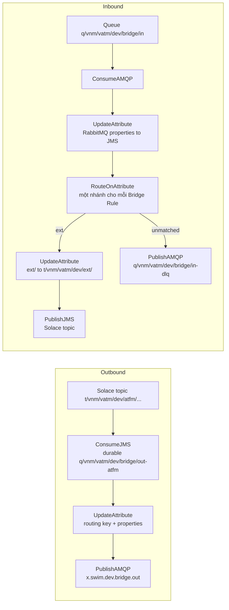

# Bridge

Bridge chuyển message giữa Solace (Internal EMS) và RabbitMQ (External EMS) theo cả hai chiều. Các thuật ngữ được định nghĩa trong `CONTEXT.md`.

Bridge là một flow Apache NiFi (`nifi/bridge-flow.json`), chạy bằng image chính thức `docker.io/apache/nifi:2.12.0`. Không có code để build. Lý do chọn cách này nằm ở `docs/adr/0004-apache-nifi-replaces-camel.md`.

Các lệnh dưới đây dùng `podman`. Nếu dùng Docker, thay `podman` bằng `docker`, mọi thứ khác giữ nguyên.

## 1. Tạo object trên RabbitMQ (một lần)

NiFi không tự tạo exchange hay queue trên RabbitMQ. Mở RabbitMQ UI `http://192.168.121.61:15672` và tạo các object dưới đây trong vhost `swim_sg`. Tất cả đều là object mới, không sửa object nào đang có.

| Bước | Ở đâu | Làm gì |
|---|---|---|
| 1 | Exchanges → Add a new exchange | Name `x.swim.dev.bridge.out`, Type `topic`, Durability `Durable` |
| 2 | Exchanges → Add a new exchange | Name `x.swim.dev.bridge.in`, Type `topic`, Durability `Durable` |
| 3 | Queues and Streams → Add a new queue | Name `q/vnm/vatm/dev/bridge/in`, Type `Classic`, Durability `Durable` |
| 4 | Queues and Streams → Add a new queue | Name `q/vnm/vatm/dev/bridge/in-dlq`, Type `Classic`, Durability `Durable` |
| 5 | Mở queue `q/vnm/vatm/dev/bridge/in` → Bindings | From exchange `x.swim.dev.bridge.in`, Routing key `#` |

Trên Solace không cần làm gì. Lần đầu chạy, Bridge tự tạo Durable Topic Endpoint `q/vnm/vatm/dev/bridge/out-atfm` nếu nó chưa có.

## 2. Tải thư viện Solace JMS

NiFi cần jar của Solace để nói chuyện với Solace. Danh sách jar nằm trong `nifi/solace-jars.txt`, tất cả lấy từ Maven Central. Chạy trong thư mục của repo:

```
mkdir -p lib
(cd lib && xargs -n1 curl -fsSLO < ../nifi/solace-jars.txt)
ls lib | wc -l     # phải ra 18
```

## 3. Chạy NiFi

Chọn mật khẩu đăng nhập NiFi, dài ít nhất 12 ký tự, và export nó trong shell. Không ghi mật khẩu vào file nào.

```
export SINGLE_USER_CREDENTIALS_PASSWORD='...'
```

Liệt kê các tên mà bạn sẽ gõ trên trình duyệt để mở NiFi, dạng `tên:8443`, cách nhau bằng dấu phẩy. Tên máy (`hostname`) và `localhost` đã có sẵn, không cần ghi. Ví dụ với tên Tailscale của máy (xem bằng `tailscale status --self`):

```
export NIFI_WEB_PROXY_HOST='solace.tailfac6af.ts.net:8443'
```

Chạy trong thư mục của repo (vì lệnh mount `./lib`):

```
podman run -d --name vatm-bridge --network=host --restart=always \
  -e NIFI_WEB_HTTPS_HOST=0.0.0.0 -e NIFI_WEB_PROXY_HOST \
  -e SINGLE_USER_CREDENTIALS_USERNAME=admin -e SINGLE_USER_CREDENTIALS_PASSWORD \
  -v vatm-bridge-conf:/opt/nifi/nifi-current/conf \
  -v vatm-bridge-state:/opt/nifi/nifi-current/state \
  -v vatm-bridge-database:/opt/nifi/nifi-current/database_repository \
  -v vatm-bridge-flowfile:/opt/nifi/nifi-current/flowfile_repository \
  -v vatm-bridge-content:/opt/nifi/nifi-current/content_repository \
  -v vatm-bridge-provenance:/opt/nifi/nifi-current/provenance_repository \
  -v ./lib:/opt/nifi/solace-lib:ro,Z \
  docker.io/apache/nifi:2.12.0
```

- `--network=host` để NiFi tới được Solace ở `localhost:55555`.
- `NIFI_WEB_HTTPS_HOST=0.0.0.0` để NiFi nghe trên mọi địa chỉ của máy (LAN, Tailscale...). Mặc định nó chỉ nghe trên địa chỉ ứng với tên máy.
- NiFi tạo chứng chỉ HTTPS tự ký ở lần chạy đầu tiên. Chứng chỉ chỉ chứa `localhost`, tên máy và các tên trong `NIFI_WEB_PROXY_HOST`. Mở bằng tên khác, hay bằng địa chỉ IP, sẽ bị lỗi `Invalid SNI`. Muốn thêm tên sau này thì phải gỡ hẳn rồi chạy lại từ đầu (xem Vận hành) và nạp lại flow.
- Các volume `vatm-bridge-*` giữ flow, mật khẩu đã nhập và các message đang trên đường đi. Đừng xoá chúng khi Bridge còn dùng.
- Mật khẩu đăng nhập chỉ được đặt ở lần chạy đầu tiên, sau đó nó được lưu trong volume `vatm-bridge-conf`.

Chờ khoảng 1 phút rồi xem log. Khi thấy dòng `Started Application` là NiFi đã sẵn sàng:

```
podman logs vatm-bridge 2>&1 | grep 'Started Application'
```

`--restart=always` chưa đủ để Bridge tự chạy lại sau khi khởi động lại máy. Cần bật thêm dịch vụ restart của Podman:

```
sudo systemctl enable --now podman-restart.service
```

Nếu chạy Podman bằng user thường (rootless):

```
systemctl --user enable --now podman-restart.service
loginctl enable-linger $USER
```

Với Docker thì chỉ cần `sudo systemctl enable --now docker`.

## 4. Nạp flow vào NiFi (một lần)

1. Mở `https://<tên>:8443/nifi` bằng một trong các tên đã khai báo ở bước 3, ví dụ `https://solace.tailfac6af.ts.net:8443/nifi` hoặc `https://solace.vnaic.vn:8443/nifi`. Không dùng địa chỉ IP. Trình duyệt sẽ cảnh báo chứng chỉ tự ký, hãy chấp nhận cảnh báo đó. Nếu bị timeout, kiểm tra firewall đã mở port 8443 chưa: `sudo firewall-cmd --permanent --zone=public --add-port=8443/tcp && sudo firewall-cmd --reload`.
2. Đăng nhập bằng user `admin` và mật khẩu đã đặt ở bước 3.
3. Kéo biểu tượng **Process Group** trên thanh công cụ thả vào canvas. Trong hộp thoại, bấm biểu tượng **Browse** (upload) cạnh ô tên, chọn file `nifi/bridge-flow.json`, rồi bấm **Add**. Một group tên `Solace RabbitMQ Bridge` xuất hiện, kèm Parameter Context `bridge`.
4. Nhập mật khẩu broker: menu ☰ (góc trên bên phải) → **Parameter Contexts** → dòng `bridge` → ⋮ → **Edit** → tab **Parameters**. Sửa `solace.password` và `rabbitmq.password` → **Apply**. Hai giá trị này được NiFi mã hoá và không bao giờ nằm trong file flow.
5. Nếu Solace hay RabbitMQ của bạn khác mặc định, sửa luôn các tham số khác ở đây: `solace.host`, `solace.vpn`, `solace.username`, `rabbitmq.host`, `rabbitmq.port`, `rabbitmq.vhost`, `rabbitmq.username`.
6. Chuột phải vào group `Solace RabbitMQ Bridge` → **Enable All Controller Services**, rồi chuột phải lần nữa → **Start**.

Bridge đã chạy. Trên mỗi processor, biểu tượng ▶ màu xanh nghĩa là đang chạy. Nếu có lỗi, một ô đỏ sẽ hiện ở góc processor; di chuột vào để đọc lỗi.

## Object

Mọi tên dưới đây là tên thật trên broker.

| Chiều | Người gửi gửi vào | Bridge đọc từ | Bridge ghi vào | Người nhận đọc từ |
|---|---|---|---|---|
| Outbound (Solace sang RabbitMQ) | Solace topic `t/vnm/vatm/dev/atfm/v1/fpl` | Durable Topic Endpoint `q/vnm/vatm/dev/bridge/out-atfm` (subscription `t/vnm/vatm/dev/atfm/>`) | Exchange `x.swim.dev.bridge.out`, Routing key `t/vnm/vatm/dev/atfm/v1/fpl` | Queue của người nhận, bind với Routing key đó |
| Inbound (RabbitMQ sang Solace) | Exchange `x.swim.dev.bridge.in`, Routing key `ext/met/metar` | Queue `q/vnm/vatm/dev/bridge/in` (bind `#`) | Solace topic `t/vnm/vatm/dev/ext/met/metar` | Solace subscription `t/vnm/vatm/dev/ext/>` |
| Dead letter | Exchange `x.swim.dev.bridge.in`, Routing key `foo/bar` (không khớp Bridge Rule nào) | Queue `q/vnm/vatm/dev/bridge/in` | Dead letter queue `q/vnm/vatm/dev/bridge/in-dlq` | Queue `q/vnm/vatm/dev/bridge/in-dlq` |

Routing key trên RabbitMQ chính là SWIM topic, giữ nguyên cả dấu `/` (xem `docs/adr/0002-routing-key-is-swim-topic-verbatim.md`).

## Flow



Mỗi processor gửi đi có một nhánh `failure` quay về chính nó. Khi broker bên kia không nhận, NiFi giữ message lại và thử gửi lại, không làm mất message.

## Demo

Mở RabbitMQ UI `http://192.168.121.61:15672` (đăng nhập bằng tài khoản của bạn) và Solace Broker Manager `http://localhost:18080` (dùng công cụ Try-Me). Bridge phải đang chạy.

### Outbound

1. Trong RabbitMQ UI, tạo queue `q/vnm/vatm/dev/bridgedemo/userb`.
2. Bind queue đó với exchange `x.swim.dev.bridge.out`, Routing key `t/vnm/vatm/dev/atfm/v1/fpl`.
3. Trong Solace Try-Me, publish một message lên topic `t/vnm/vatm/dev/atfm/v1/fpl`.
4. Trong RabbitMQ UI, mở queue `q/vnm/vatm/dev/bridgedemo/userb` và bấm **Get messages**. Message của bạn nằm ở đó.

### Inbound

1. Trong Solace Try-Me, subscribe `t/vnm/vatm/dev/ext/>`.
2. Trong RabbitMQ UI, mở exchange `x.swim.dev.bridge.in` và publish một message với Routing key `ext/met/metar`.
3. Try-Me hiện message đó trên topic `t/vnm/vatm/dev/ext/met/metar`.

### Dead letter

1. Trong RabbitMQ UI, publish một message vào `x.swim.dev.bridge.in` với Routing key `foo/bar`. Không Bridge Rule nào khớp với key này.
2. Mở queue `q/vnm/vatm/dev/bridge/in-dlq` và bấm **Get messages**. Message nằm ở đó.

### Dọn dẹp

Xoá queue demo `q/vnm/vatm/dev/bridgedemo/userb` trong RabbitMQ UI.

## Những gì Bridge giữ lại

- Nội dung message giữ nguyên.
- Outbound: thuộc tính JMS `contentType`, JMS message id, JMS correlation id và JMS delivery mode (persistent hay không) trở thành `content_type`, `message_id`, `correlation_id` và `delivery_mode` trên RabbitMQ. Các JMS property khác do người gửi đặt (ví dụ `priority=high`) trở thành header trên RabbitMQ.
- Inbound: `content_type`, `message_id` và `correlation_id` trên RabbitMQ trở thành JMS property `contentType`, `messageId` và JMS correlation id trên Solace. Message tới Solace luôn là TextMessage (UTF-8), vì SWIM payload là XML hoặc JSON. Header của RabbitMQ **không** được chuyển sang Solace.
- Dead letter: message giữ nguyên nội dung, các thuộc tính và header.

## Thêm Bridge Rule

Một Bridge Rule gồm chiều (out hoặc in), prefix nguồn và prefix đích. Phần tên phía sau prefix nguồn được giữ nguyên. Mỗi rule là một vài processor trong group `Solace RabbitMQ Bridge`. Chọn đúng processor rồi chuột phải → **Configure** → tab **Properties** để sửa.

Lưu ý:
- Trong cùng một chiều, các prefix nguồn không được chồng lên nhau, nếu không một message sẽ được chuyển hai lần.
- Đích của rule `in` không được nằm trong nguồn của rule `out` nào, nếu không message sẽ chạy vòng giữa hai broker.

### Rule out (Solace sang RabbitMQ)

Ví dụ: rule `met` chuyển `t/vnm/vatm/dev/met/...` sang Routing key giữ nguyên tên.

1. Chọn cả hai processor `out atfm: ...`, nhấn Ctrl+C rồi Ctrl+V.
2. Ở bản sao của **ConsumeJMS**:
   - `Destination Name` = `t/vnm/vatm/dev/met/>` (prefix nguồn, kết thúc bằng `/`, rồi `>`)
   - `Subscription Name` = `q/vnm/vatm/dev/bridge/out-met` (mỗi rule một tên riêng; đây là tên Durable Topic Endpoint)
3. Ở bản sao của **UpdateAttribute**, sửa `routingKey` = `<prefix đích>${jms_destination:substringAfter('<prefix nguồn>')}`, ví dụ `t/vnm/vatm/dev/met/${jms_destination:substringAfter('t/vnm/vatm/dev/met/')}`.
4. Đổi tên hai processor cho dễ đọc, nối bản sao UpdateAttribute (`success`) vào `Publish to RabbitMQ x.swim.dev.bridge.out`, rồi Start hai processor mới.

### Rule in (RabbitMQ sang Solace)

Ví dụ: rule `aim` chuyển Routing key `aim/...` sang `t/vnm/vatm/dev/aim/...`.

1. Ở processor **in: match Bridge Rule** (RouteOnAttribute), bấm **+** để thêm property tên `aim`, giá trị `${'amqp$routingKey':startsWith('aim/')}`.
2. Copy processor `in ext: ...`. Ở bản sao, sửa `topic` = `t/vnm/vatm/dev/aim/${'amqp$routingKey':substringAfter('aim/')}`.
3. Nối `in: match Bridge Rule` (relationship `aim`) vào bản sao, rồi nối bản sao (`success`) vào `Publish to Solace topic`. Start bản sao.

### Lưu flow sau khi sửa

NiFi tự lưu flow vào volume. Để repo luôn có bản mới nhất: chuột phải vào group → **Download Flow Definition** → **Without External Services**, rồi ghi đè `nifi/bridge-flow.json` và commit. File này không chứa mật khẩu.

## Vận hành

Xem log:

```
podman logs -f vatm-bridge
```

Dừng hoặc chạy lại Bridge (flow và message đang chờ vẫn còn):

```
podman stop vatm-bridge
podman start vatm-bridge
```

Lên phiên bản NiFi mới: xoá container cũ, rồi chạy lại lệnh ở bước 3 với tag mới. Các volume vẫn giữ flow và mật khẩu.

```
podman rm -f vatm-bridge
podman run ... docker.io/apache/nifi:<phiên bản mới>
```

Gỡ hẳn Bridge (mất flow và các message đang chờ trong NiFi):

```
podman rm -f vatm-bridge
podman volume rm vatm-bridge-conf vatm-bridge-state vatm-bridge-database vatm-bridge-flowfile vatm-bridge-content vatm-bridge-provenance
```
