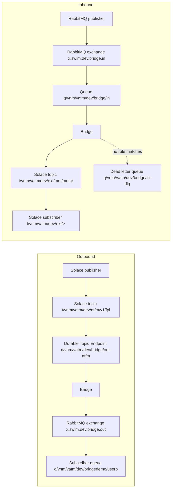

# Bridge

The Bridge passes messages between Solace and RabbitMQ in both directions (see `CONTEXT.md` for the terms).

## Run

Build the image:

```
podman build -t vatm-bridge .
```

Export the two passwords in your shell first. The Bridge reads them from the environment variables `SOLACE_PASSWORD` and `RABBITMQ_PASSWORD`. Do not write them in any file.

Start the Bridge:

```
podman run -d --name vatm-bridge --network=host --restart=always -e SOLACE_PASSWORD -e RABBITMQ_PASSWORD vatm-bridge
```

`--network=host` lets the container reach Solace at `localhost:55555`.

`--restart=always` alone does not bring the Bridge back after a reboot. Also enable the Podman restart service:

```
sudo systemctl enable --now podman-restart.service
```

If you run Podman as a normal user (rootless), use this instead:

```
systemctl --user enable --now podman-restart.service
loginctl enable-linger $USER
```

Show the logs:

```
podman logs -f vatm-bridge
```

## Objects

Every name below is a real name on the brokers. The Bridge copies each message from one side to the other.

| Direction | Publisher publishes on | Bridge reads from | Bridge writes to | Subscriber reads from |
|---|---|---|---|---|
| Outbound (Solace to RabbitMQ) | Solace topic `t/vnm/vatm/dev/atfm/v1/fpl` | Durable Topic Endpoint `q/vnm/vatm/dev/bridge/out-atfm` (subscription `t/vnm/vatm/dev/atfm/>`) | Exchange `x.swim.dev.bridge.out`, Routing key `t/vnm/vatm/dev/atfm/v1/fpl` | Queue `q/vnm/vatm/dev/bridgedemo/userb` |
| Inbound (RabbitMQ to Solace) | Exchange `x.swim.dev.bridge.in`, Routing key `ext/met/metar` | Queue `q/vnm/vatm/dev/bridge/in` (bound with `#`) | Solace topic `t/vnm/vatm/dev/ext/met/metar` | Solace subscription `t/vnm/vatm/dev/ext/>` |
| Dead letter | Exchange `x.swim.dev.bridge.in`, Routing key `foo/bar` (no rule matches) | Queue `q/vnm/vatm/dev/bridge/in` | Queue `q/vnm/vatm/dev/bridge/in-dlq` | Queue `q/vnm/vatm/dev/bridge/in-dlq` |

## Flow



## Demo

Open two web pages: the RabbitMQ management UI at `http://192.168.121.61:15672` (user `hieu`, log in with your own password) and the Solace Broker Manager at `http://localhost:18080` (use its Try-Me tool). The Bridge must be running (see Run).

### Outbound

1. In the RabbitMQ UI, create the queue `q/vnm/vatm/dev/bridgedemo/userb`.
2. Bind it to the exchange `x.swim.dev.bridge.out` with Routing key `t/vnm/vatm/dev/atfm/v1/fpl`.
3. In Solace Try-Me, publish a message on the topic `t/vnm/vatm/dev/atfm/v1/fpl`.
4. In the RabbitMQ UI, open the queue and press "Get messages". Your message is there.

### Inbound

1. In Solace Try-Me, subscribe to `t/vnm/vatm/dev/ext/>`.
2. In the RabbitMQ UI, open the exchange `x.swim.dev.bridge.in` and publish a message with Routing key `ext/met/metar`.
3. Try-Me shows the message on the topic `t/vnm/vatm/dev/ext/met/metar`.

### Dead letter

1. In the RabbitMQ UI, publish a message to `x.swim.dev.bridge.in` with Routing key `foo/bar`. No rule matches this key.
2. Open the queue `q/vnm/vatm/dev/bridge/in-dlq` and press "Get messages". The message is there.

### Clean up

Delete the demo queue `q/vnm/vatm/dev/bridgedemo/userb` in the RabbitMQ UI.

### What the Bridge keeps

- The content type, the message id and the correlation id travel with the message.
  - Outbound: the Bridge reads the content type from the Solace JMS property `contentType`, the message id from the JMS message id, and the correlation id from the JMS correlation id. It writes them to the RabbitMQ properties `content_type`, `message_id` and `correlation_id`.
  - Inbound: the Bridge reads the RabbitMQ properties `content_type`, `message_id` and `correlation_id`. It writes them to the Solace JMS properties `contentType` and `messageId`, and to the JMS correlation id.
- The Bridge adds the mark `bridgeOrigin` to every message it copies. This is how it ignores its own messages, so a message never loops between the two brokers.

## Add a Bridge Rule

A Bridge Rule says which messages the Bridge copies. Rules are in the property `bridge.rules`, in this format:

```
<in|out> <name> <source prefix> <target prefix>
```

Separate rules with commas. Example (this is the default):

```
bridge.rules=\
  out atfm t/vnm/vatm/dev/atfm/ t/vnm/vatm/dev/atfm/,\
  in  ext  ext/                 t/vnm/vatm/dev/ext/
```

- `out` means Solace to RabbitMQ. `in` means RabbitMQ to Solace.
- An Outbound source prefix must end with `/`.
- In one direction, sources must not overlap. If they do, the Bridge refuses to start.
- Each Outbound rule gets its own Durable Topic Endpoint. Its name is `bridge.out.durable-prefix` plus the rule name (for example `q/vnm/vatm/dev/bridge/out-atfm`).

`podman restart` keeps the old image and the old `-e` settings, so it does not pick up a change. To change the rules, create the container again.

If you keep the rules in the properties: edit `bridge.rules` in `src/main/resources/application.properties`, rebuild the image, remove the old container, and start it again with the same `podman run` command as in Run:

```
podman build -t vatm-bridge .
podman rm -f vatm-bridge
podman run -d --name vatm-bridge --network=host --restart=always -e SOLACE_PASSWORD -e RABBITMQ_PASSWORD vatm-bridge
```

If you set the environment variable `BRIDGE_RULES`: remove the old container and start it again with the extra `-e BRIDGE_RULES=...`. Put the value in quotes, because it has spaces and commas:

```
podman rm -f vatm-bridge
podman run -d --name vatm-bridge --network=host --restart=always -e SOLACE_PASSWORD -e RABBITMQ_PASSWORD -e BRIDGE_RULES="out atfm t/vnm/vatm/dev/atfm/ t/vnm/vatm/dev/atfm/,in ext ext/ t/vnm/vatm/dev/ext/" vatm-bridge
```

## Tests

Export the two passwords, then run the tests:

```
export SOLACE_PASSWORD=... RABBITMQ_PASSWORD=...
./mvnw -q test
```

Replace `...` with your own passwords. The Testcontainers broker tests do not use these two variables. Tests use only names that contain `bridgetest`.

The broker tests start their own throwaway RabbitMQ and Solace containers with Testcontainers, and they never touch the live brokers. This needs the Podman socket, so set `DOCKER_HOST`, for example:

```
export DOCKER_HOST=unix:///run/podman/podman.sock
```

If you run Podman as a normal user (rootless), use this socket instead:

```
export DOCKER_HOST=unix:///run/user/$UID/podman/podman.sock
```
