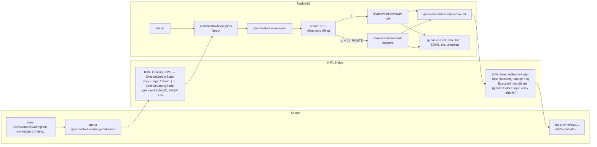

# Bridge

Bridge chuyển message giữa Solace (Internal EMS) và RabbitMQ (External EMS) theo cả hai chiều, theo mô hình EMS của VATM trong `docs/Documents/SWIM_APAC_Giai_thich_EMS_v4.docx` và `docs/Documents/SWIM_APAC_Cau_hinh_EMS_v4.xlsx`: **header ở biên, topic bên trong**. Bridge chỉ gồm hai đường: **B-03** (RabbitMQ sang Solace) và **B-04** (Solace sang RabbitMQ).

Bridge chuyển message **nguyên vẹn**: không sửa payload, header nào, message-id, correlation-id, content-type hay reply-to, và không ghi gì vào `APAC_TIMESTAMP`. Ngoại lệ duy nhất: header `VV_ROUTE` chỉ dùng bên trong RabbitMQ, nên B-03 bỏ nó trước khi message vào Solace. Chi tiết ở [Những gì Bridge giữ lại](#những-gì-bridge-giữ-lại).

Định tuyến bên trong RabbitMQ (Router R-01: tách `APAC_RECIPIENT_LIST`, đặt `VV_ROUTE`, ghi dấu `VV_EEMS_IN`/`VV_EEMS_OUT` vào `APAC_TIMESTAMP`, Dead letter queue, GEMS) **không** thuộc Bridge và không nằm trong repo này. Router là một ứng dụng riêng phía RabbitMQ. Lý do ở `docs/adr/0006-bridge-carries-messages-unchanged.md`.

Mỗi chiều đi được theo hai cách định tuyến:

- **Topic routing** (Pub/Sub, topic `t/...`): message đi theo tên topic. Trên RabbitMQ là binding của topic exchange, trên Solace là subscription.
- **Header routing** (Request/Reply, topic `tr/...`): message đi theo header `APAC_RECIPIENT_LIST`. Trên RabbitMQ, Router tách danh sách này thành từng bản sao có header `VV_ROUTE`, rồi headers exchange chọn queue theo `VV_ROUTE` + `APAC_CATEGORY`. Trên Solace, người nhận lọc bằng selector trên `APAC_RECIPIENT_LIST`.

Các thuật ngữ được định nghĩa trong `CONTEXT.md`.

Bridge là một flow Apache NiFi (`nifi/bridge-flow.json`), chạy bằng image chính thức `docker.io/apache/nifi:2.12.0`. Không có code để build. Lý do chọn cách này nằm ở `docs/adr/0004-apache-nifi-replaces-camel.md`. Bridge nói AMQP 1.0 với RabbitMQ, như mọi EMS trong vùng (`docs/adr/0007-bridge-talks-amqp-1-0.md`).

Đây là bản **thử nghiệm**, mọi object dùng token môi trường `dev`. Bridge chỉ dùng object mới tạo ở bước 1, không sửa object hay cấu hình nào đang có trên hai broker.

Các lệnh dưới đây dùng `podman`. Nếu dùng Docker, thay `podman` bằng `docker`, mọi thứ khác giữ nguyên.

## 1. Tạo object trên hai broker (một lần)

NiFi không tự tạo exchange hay queue. Tạo các object dưới đây bằng tay. Tất cả đều là object mới, không sửa object nào đang có.

### RabbitMQ

Các object RabbitMQ thuộc phía RabbitMQ (Router và các bên nhận). Bridge chỉ dùng hai cái: gửi vào exchange `x/vnm/vatm/dev/ingress` và đọc queue `q/vnm/vatm/dev/bridge/inbound`. Các object còn lại cần cho [Demo](#demo) và [script kiểm tra](#kiểm-tra-bằng-tay).

Mở RabbitMQ UI `http://192.168.121.61:15672`, làm trong vhost `swim_sg`. Mọi exchange đều `Durable`; mọi queue đều Type `Classic`, Durability `Durable`.

Exchanges → **Add a new exchange**, tạo theo đúng thứ tự (hai exchange `unrouted` và `dlx` phải có trước):

| Name | Type | Arguments |
|---|---|---|
| `x/vnm/vatm/dev/unrouted` | `fanout` | |
| `x/vnm/vatm/dev/dlx` | `fanout` | |
| `x/vnm/vatm/dev/ingress` | `fanout` | |
| `x/vnm/vatm/dev/swim` | `topic` | `alternate-exchange` = `x/vnm/vatm/dev/unrouted` |
| `x/vnm/vatm/dev/route` | `headers` | `alternate-exchange` = `x/vnm/vatm/dev/unrouted` |

`alternate-exchange` gõ ở ô Arguments (hoặc bấm link **Alternate exchange** bên dưới ô đó). Nhờ nó, message không khớp binding nào rơi vào `unrouted` thay vì bị RabbitMQ bỏ.

Queues and Streams → **Add a new queue**, rồi mở từng queue → **Bindings** → **Add binding to this queue**:

| Queue | From exchange | Routing key | Arguments | Dùng cho |
|---|---|---|---|---|
| `q/vnm/vatm/dev/router/in` | `x/vnm/vatm/dev/ingress` | | | Router (ứng dụng riêng) đọc mọi message vào |
| `q/vnm/vatm/dev/bridge/inbound` | `x/vnm/vatm/dev/swim` | `t.vnm.acv.dev.#` | | Bridge đưa sang Solace (topic) |
| | `x/vnm/vatm/dev/route` | | `x-match` = `all`, `VV_ROUTE` = `VV_VATM` | Bridge đưa sang Solace (header) |
| `q/vnm/vna/dev/swim/flight` | `x/vnm/vatm/dev/swim` | `t.vnm.vatm.dev.atfm.#` | | Vietnam Airlines (topic) |
| | `x/vnm/vatm/dev/route` | | `x-match` = `all`, `VV_ROUTE` = `VV_HVN`, `APAC_CATEGORY` = `FIXM` | Vietnam Airlines (header) |
| `q/vnm/vatm/dev/eems/to-gems` | `x/vnm/vatm/dev/swim` | `t.vnm.vatm.dev.met.#` | | GEMS (topic) |
| | `x/vnm/vatm/dev/route` | | `x-match` = `all`, `VV_ROUTE` = `GEMS` | GEMS (header) |
| `q/vnm/vatm/dev/eems/unrouted` | `x/vnm/vatm/dev/unrouted` | | | message không khớp binding nào |
| `q/vnm/vatm/dev/eems/dlq` | `x/vnm/vatm/dev/dlx` | | | Dead letter queue |

Với binding headers: để trống Routing key, mỗi argument một dòng, kiểu `String`.

### Solace

Mở Solace Broker Manager `http://localhost:18080`, Message VPN `default` → **Queues** → **+ Queue**:

- Name `q/vnm/vatm/dev/bridge/outbound`
- Access Type `Exclusive`, Non-Owner Permission `Consume`
- Bật **Respect TTL**. Thư viện Solace JMS của NiFi kiểm tra giá trị này khi kết nối và báo lỗi `Respect TTL mismatch` nếu nó tắt.

Mở queue → **Subscriptions** → **+ Subscription**, thêm ba topic VATM gửi ra:

| Subscription | Cách định tuyến |
|---|---|
| `t/vnm/vatm/dev/atfm/>` | topic |
| `t/vnm/vatm/dev/met/>` | topic |
| `tr/vnm/vatm/*/*/dev/>` | header (Request/Reply do VATM gửi tới bất kỳ ai) |

Không subscribe rộng `t/vnm/vatm/dev/>`: topic `t/vnm/vatm/dev/swim/>` đang được hệ thống khác dùng (queue `Q.BRIDGE.TO_RABBIT.ALL`, `q/vnm/vatm/ffice-out`), Bridge thử nghiệm không được lấy message của họ. Cũng không subscribe topic đi **vào** VATM (`t/vnm/acv/...`, `tr/*/*/vnm/vatm/...`), nếu không message Bridge vừa đưa sang Solace sẽ quay lại RabbitMQ thành vòng. Router phía RabbitMQ còn chặn thêm: key `tr.` phải mang đúng người gửi `APAC_SOURCE`, nên Bridge không bao giờ đưa lên Solace topic `tr/vnm/vatm/...` (VATM gửi tới chính mình).

### Object cũ

Bản trước của Bridge dùng exchange `x.swim.dev.bridge.out`, `x.swim.dev.bridge.in`, queue `q/vnm/vatm/dev/bridge/in`, `q/vnm/vatm/dev/bridge/in-dlq` trên RabbitMQ và Durable Topic Endpoint `q/vnm/vatm/dev/bridge/out-atfm` trên Solace. Bridge không dùng chúng nữa và không xoá chúng. Topic Endpoint `out-atfm` vẫn giữ lại mọi message `t/vnm/vatm/dev/atfm/>` cho tới khi đầy. Khi không cần nữa, tự xoá: RabbitMQ UI → mở exchange / queue → **Delete**; Broker Manager → **Queues** → tab **Topic Endpoints** → `q/vnm/vatm/dev/bridge/out-atfm` → **Delete**.

## 2. Tải thư viện Solace JMS và RabbitMQ AMQP 1.0

NiFi cần jar của Solace để nói chuyện với Solace, và thư viện AMQP 1.0 của RabbitMQ để nói chuyện với RabbitMQ: processor RabbitMQ có sẵn của NiFi chỉ nói AMQP 0-9-1, còn vùng dùng AMQP 1.0 (`docs/adr/0007-bridge-talks-amqp-1-0.md`). Danh sách jar nằm trong `nifi/solace-jars.txt` và `nifi/rabbitmq-jars.txt`, tất cả lấy từ Maven Central. Hai bộ jar nằm ở hai thư mục riêng, để jar của RabbitMQ không lẫn vào chỗ NiFi nạp Solace JMS. Chạy trong thư mục của repo:

```
mkdir -p lib lib-rabbitmq
(cd lib && xargs -n1 curl -fsSLO < ../nifi/solace-jars.txt)
(cd lib-rabbitmq && xargs -n1 curl -fsSLO < ../nifi/rabbitmq-jars.txt)
ls lib | wc -l            # phải ra 18
ls lib-rabbitmq | wc -l   # phải ra 11
```

## 3. Chạy NiFi

Chọn mật khẩu đăng nhập NiFi, dài ít nhất 12 ký tự, và export nó trong shell. Không ghi mật khẩu vào file nào.

```
export SINGLE_USER_CREDENTIALS_PASSWORD='...'
```

Liệt kê các tên mà bạn sẽ gõ trên trình duyệt để mở NiFi, dạng `tên:8443`, cách nhau bằng dấu phẩy. Tên máy (`hostname`) và `localhost` đã có sẵn, không cần ghi. Ví dụ với tên Tailscale của máy (xem bằng `tailscale status --self`):

```
export NIFI_WEB_PROXY_HOST='solace.tailfac6af.ts.net:8443'
```

Chạy trong thư mục của repo (vì lệnh mount `./lib` và `./lib-rabbitmq`):

```
podman run -d --name vatm-bridge --network=host --restart=always \
  -e NIFI_WEB_HTTPS_HOST=0.0.0.0 -e NIFI_WEB_PROXY_HOST \
  -e SINGLE_USER_CREDENTIALS_USERNAME=admin -e SINGLE_USER_CREDENTIALS_PASSWORD \
  -v vatm-bridge-conf:/opt/nifi/nifi-current/conf \
  -v vatm-bridge-state:/opt/nifi/nifi-current/state \
  -v vatm-bridge-database:/opt/nifi/nifi-current/database_repository \
  -v vatm-bridge-flowfile:/opt/nifi/nifi-current/flowfile_repository \
  -v vatm-bridge-content:/opt/nifi/nifi-current/content_repository \
  -v vatm-bridge-provenance:/opt/nifi/nifi-current/provenance_repository \
  -v ./lib:/opt/nifi/solace-lib:ro,Z \
  -v ./lib-rabbitmq:/opt/nifi/rabbitmq-lib:ro,Z \
  docker.io/apache/nifi:2.12.0
```

- `--network=host` để NiFi tới được Solace ở `localhost:55555`.
- `NIFI_WEB_HTTPS_HOST=0.0.0.0` để NiFi nghe trên mọi địa chỉ của máy (LAN, Tailscale...). Mặc định nó chỉ nghe trên địa chỉ ứng với tên máy.
- NiFi tạo chứng chỉ HTTPS tự ký ở lần chạy đầu tiên. Chứng chỉ chỉ chứa `localhost`, tên máy và các tên trong `NIFI_WEB_PROXY_HOST`. Mở bằng tên khác, hay bằng địa chỉ IP, sẽ bị lỗi `Invalid SNI`. Muốn thêm tên sau này thì phải gỡ hẳn rồi chạy lại từ đầu (xem Vận hành) và nạp lại flow.
- Các volume `vatm-bridge-*` giữ flow, mật khẩu đã nhập và các message đang trên đường đi. Đừng xoá chúng khi Bridge còn dùng.
- Mật khẩu đăng nhập chỉ được đặt ở lần chạy đầu tiên, sau đó nó được lưu trong volume `vatm-bridge-conf`.
- Container chạy từ trước khi có mount `./lib-rabbitmq`: tải jar ở bước 2, `podman rm -f vatm-bridge`, rồi chạy lại lệnh trên. Các volume vẫn giữ flow, mật khẩu và message đang chờ.

Chờ khoảng 1 phút rồi xem log. Khi thấy dòng `Started Application` là NiFi đã sẵn sàng:

```
podman logs vatm-bridge 2>&1 | grep 'Started Application'
```

`--restart=always` chưa đủ để Bridge tự chạy lại sau khi khởi động lại máy. Cần bật thêm dịch vụ restart của Podman:

```
sudo systemctl enable --now podman-restart.service
```

Nếu chạy Podman bằng user thường (rootless):

```
systemctl --user enable --now podman-restart.service
loginctl enable-linger $USER
```

Với Docker thì chỉ cần `sudo systemctl enable --now docker`.

## 4. Nạp flow vào NiFi (một lần)

1. Mở `https://<tên>:8443/nifi` bằng một trong các tên đã khai báo ở bước 3, ví dụ `https://solace.tailfac6af.ts.net:8443/nifi` hoặc `https://solace.vnaic.vn:8443/nifi`. Không dùng địa chỉ IP. Trình duyệt sẽ cảnh báo chứng chỉ tự ký, hãy chấp nhận cảnh báo đó. Nếu bị timeout, kiểm tra firewall đã mở port 8443 chưa: `sudo firewall-cmd --permanent --zone=public --add-port=8443/tcp && sudo firewall-cmd --reload`.
2. Đăng nhập bằng user `admin` và mật khẩu đã đặt ở bước 3.
3. Kéo biểu tượng **Process Group** trên thanh công cụ thả vào canvas. Trong hộp thoại, bấm biểu tượng **Browse** (upload) cạnh ô tên, chọn file `nifi/bridge-flow.json`, rồi bấm **Add**. Một group tên `Solace RabbitMQ Bridge` xuất hiện, kèm Parameter Context `bridge`.
4. Nhập mật khẩu broker: menu ☰ (góc trên bên phải) → **Parameter Contexts** → dòng `bridge` → ⋮ → **Edit** → tab **Parameters**. Sửa `solace.password` và `rabbitmq.password` → **Apply**. Hai giá trị này được NiFi mã hoá và không bao giờ nằm trong file flow.
5. Nếu Solace hay RabbitMQ của bạn khác mặc định, sửa luôn các tham số khác ở đây: `solace.host`, `solace.vpn`, `solace.username`, `rabbitmq.host`, `rabbitmq.port`, `rabbitmq.vhost`, `rabbitmq.username`.
6. Chuột phải vào group `Solace RabbitMQ Bridge` → **Enable All Controller Services**, rồi chuột phải lần nữa → **Start**.

Group con `Bridge demo` vẫn ở trạng thái Disabled, nó chỉ dùng cho phần [Demo](#demo).

Bridge đã chạy. Trên mỗi processor, biểu tượng ▶ màu xanh nghĩa là đang chạy. Nếu có lỗi, một ô đỏ sẽ hiện ở góc processor; di chuột vào để đọc lỗi.

## Object

Mọi tên dưới đây là tên thật trên broker. Routing key trên RabbitMQ là SWIM topic đổi `/` thành `.` (xem `docs/adr/0005-routing-key-uses-dots.md`), nên binding dùng được wildcard `#` và `*`.

| Chiều | Cách | Người gửi gửi vào | Bridge (B-03, B-04) và Router (ứng dụng riêng) làm gì | Người nhận đọc từ |
|---|---|---|---|---|
| Outbound (Solace sang RabbitMQ) | topic | Solace topic `t/vnm/vatm/dev/atfm/v1/fpl` | B-04 đọc queue `q/vnm/vatm/dev/bridge/outbound`, gửi vào `x/vnm/vatm/dev/ingress` với key `t.vnm.vatm.dev.atfm.v1.fpl`; Router gửi tiếp vào `x/vnm/vatm/dev/swim` | `q/vnm/vna/dev/swim/flight` (binding `t.vnm.vatm.dev.atfm.#`) |
| Outbound | header | Solace topic `tr/vnm/vatm/vnm/vna/dev/fpms/v1/filing/reply`, `APAC_RECIPIENT_LIST` = `VV_HVN,WS_CAAS` | như trên, rồi Router tạo một bản `VV_ROUTE=VV_HVN` và một bản `VV_ROUTE=GEMS`, gửi vào `x/vnm/vatm/dev/route` | `q/vnm/vna/dev/swim/flight` và `q/vnm/vatm/dev/eems/to-gems` |
| Inbound (RabbitMQ sang Solace) | topic | Exchange `x/vnm/vatm/dev/ingress`, key `t.vnm.acv.dev.aodb.v1.departure.publish.vvts` | Router gửi vào `swim`; B-03 đọc `q/vnm/vatm/dev/bridge/inbound`, gửi lên Solace topic `t/vnm/acv/dev/aodb/v1/departure/publish/vvts` | Solace subscription `t/vnm/acv/dev/>` |
| Inbound | header | Exchange `x/vnm/vatm/dev/ingress`, key `tr.vnm.vna.vnm.vatm.dev.swim.v1.filing.request`, `APAC_RECIPIENT_LIST` = `VV_VATM,WS_CAAS` | Router tạo bản `VV_ROUTE=VV_VATM` (tới `bridge/inbound`, B-03 đưa lên Solace topic `tr/vnm/vna/vnm/vatm/dev/swim/v1/filing/request`) và bản `VV_ROUTE=GEMS` | Solace subscription `tr/*/*/vnm/vatm/dev/>` với selector (xem dưới); `q/vnm/vatm/dev/eems/to-gems` |
| Không gửi được | | `APAC_RECIPIENT_LIST` có mã lạ (ví dụ `VV_XYZ`), thiếu header bắt buộc, key không bắt đầu bằng `t.`/`tr.`, người gửi trong key `tr.` khác `APAC_SOURCE` | Router gửi vào `x/vnm/vatm/dev/dlx` kèm header `VV_DLX_REASON` | `q/vnm/vatm/dev/eems/dlq` |
| Không khớp binding | | Bản sao không queue nào bind, ví dụ `VV_ROUTE=VV_HVN` với `APAC_CATEGORY=JSON` | `swim`/`route` chuyển sang alternate exchange `unrouted` | `q/vnm/vatm/dev/eems/unrouted` |

Selector cho người nhận VATM trên Solace (sheet `Solace_Selector`). `_` phải được escape vì trong `LIKE` nó là ký tự đại diện:

```
APAC_RECIPIENT_LIST = 'VV_VATM' OR APAC_RECIPIENT_LIST LIKE 'VV\_VATM,%' ESCAPE '\'
OR APAC_RECIPIENT_LIST LIKE '%,VV\_VATM' ESCAPE '\' OR APAC_RECIPIENT_LIST LIKE '%,VV\_VATM,%' ESCAPE '\'
```

## Flow



B-04 đưa mọi message từ Solace vào `ingress`, cùng chỗ với message của đối tác; từ đó Router định tuyến. B-03 đọc những gì Router gửi tới VATM. Khi Router chưa chạy (như môi trường `dev` hiện nay), message outbound nằm chờ ở `q/vnm/vatm/dev/router/in`.

Khi broker bên kia không nhận, NiFi giữ message lại và thử gửi lại, không làm mất message: B-04 chỉ coi message là đã gửi khi RabbitMQ trả lời `accepted`, nếu không message vào nhánh `failure` quay về chính processor gửi; B-03 gửi mỗi lô trong một transaction JMS, nên khi Solace không nhận thì cả lô quay về connection trước nó (rollback) và được gửi lại sau, không có bản trùng. Một message B-03 không chuyển được thành JMS (ví dụ tên header không hợp lệ) đi vào nhánh `failure` vòng quanh processor, các message khác vẫn đi tiếp. Các processor đọc (`B-03 Consume RabbitMQ ...`, ConsumeJMS) chỉ ack message với broker khi message đã được ghi vào kho của NiFi (volume `vatm-bridge-flowfile`), nên NiFi dừng giữa chừng cũng không mất message; tệ nhất là một message tới hai lần.

Bridge nói AMQP 1.0 với RabbitMQ (cổng `5672`), giống mọi EMS trong vùng. Chưa làm: tài liệu v4 dùng AMQP 1.0 qua TLS/mTLS cổng `5671`; Bridge hiện nối cổng `5672` không mã hoá.

## Demo

Phần này demo trên UI cả bốn đường: Outbound và Inbound, mỗi chiều theo topic và theo header. Message mang header theo template Pathfinder (`docs/Documents/Pathfinder_Headers_Metadata_updated 24 Sep 2026.xlsx`, sheet "Headers for SIPG Test"). Muốn kiểm tra tự động, so từng byte, thì xem [Kiểm tra bằng tay](#kiểm-tra-bằng-tay).

Bạn dùng ba trang:
- NiFi `https://<tên>:8443/nifi`
- RabbitMQ UI `http://192.168.121.61:15672`
- Solace Broker Manager `http://localhost:18080` (không bắt buộc)

Phía Solace được demo bằng NiFi, vì Try-Me trong Broker Manager chỉ đặt được correlation id, priority, TTL và delivery mode, không đặt hay hiển thị được user property (header).

Trong group `Solace RabbitMQ Bridge` có sẵn group con **`Bridge demo`**, đi kèm `nifi/bridge-flow.json`. Mọi processor trong đó đang ở trạng thái Disabled, nên nó không gửi gì khi bạn Start Bridge. Group gồm:

| Processor | Làm gì |
|---|---|
| `Solace sender: Pathfinder message` → `Solace sender: publish ${topic}` | Tạo message FIXM mẫu có đủ 14 header Pathfinder, gửi lên Solace topic lấy từ property `topic` (mặc định `t/vnm/vatm/dev/atfm/v1/fpl`). Bản đã gửi nằm lại ở connection `sent to Solace`. |
| `Solace receiver (topic): subscribe t/vnm/acv/dev/>` | Nhận message Bridge đưa lên Solace theo topic. |
| `Solace receiver (header): subscribe tr/*/*/vnm/vatm/dev/> where APAC_RECIPIENT_LIST has VV_VATM` | Nhận message Request/Reply gửi tới VATM, lọc bằng selector ở mục [Object](#object). |
| | Cả hai receiver đổ vào connection `received from Solace`. |
| `RabbitMQ sender: Pathfinder message` → `RabbitMQ sender: publish x/vnm/vatm/dev/route, as the Router would (AMQP 1.0)` | Tạo cùng message mẫu như một đối tác (`APAC_SOURCE` = `VV_HVN`) và gửi thẳng vào `x/vnm/vatm/dev/route` với header `VV_ROUTE` = `VV_VATM`, đúng như bản Router tạo cho VATM. Router không thuộc Bridge, nên demo đứng thay nó. Key lấy từ property `routingKey` (mặc định `tr.vnm.vna.vnm.vatm.dev.swim.v1.filing.request`, `APAC_RECIPIENT_LIST` = `VV_VATM,WS_CAAS`). Bản đã gửi nằm ở `sent to RabbitMQ`. |

**Xem header và payload của một message trong NiFi:** chuột phải vào connection (mũi tên có tên, ví dụ `received from Solace`) → **List Queue**. Ở dòng message, bấm ⋮ → **View Details**. Tab **Attributes** là các header, nút **View** (hoặc ⋮ → **View Content**) mở payload.

**Sửa header hay payload mẫu:** chuột phải vào processor `... sender: Pathfinder message` → **Configure** → tab **Properties**. Mỗi header là một property: tên property là tên header, giá trị là giá trị header. Bấm **+** để thêm, biểu tượng thùng rác để xoá. Payload nằm ở property `Custom Text`.

**Xem message trên RabbitMQ:** mở queue → **Get messages** → Ack Mode `Nack message requeue true` → **Get Message(s)**. Message vẫn nằm lại trong queue để xem lại; cách lấy hẳn ra ở [Dọn dẹp](#dọn-dẹp).

### Chuẩn bị

1. NiFi: mở group `Solace RabbitMQ Bridge`. Chuột phải vào `Bridge demo` → **Enable**, rồi bấm đúp để mở group.
2. Giữ Shift, chọn 4 processor `Solace receiver (topic) ...`, `Solace receiver (header) ...`, `Solace sender: publish ...` và `RabbitMQ sender: publish ...`. Chuột phải → **Start**. Không Start cả group, vì như vậy hai processor `... Pathfinder message` sẽ gửi message ngay.

### 1. Outbound theo topic

1. NiFi: chuột phải vào `Solace sender: Pathfinder message` → **Run Once**. Message lên Solace topic `t/vnm/vatm/dev/atfm/v1/fpl`.
2. RabbitMQ UI: queue `q/vnm/vatm/dev/router/in` → **Get messages**. Khi Router chạy, message đi tiếp tới `q/vnm/vna/dev/swim/flight` thay vì nằm ở đây.
3. Kết quả mong đợi:
   - Routing key là `t.vnm.vatm.dev.atfm.v1.fpl`. Không có header `VV_ROUTE`.
   - `headers` có đủ 14 header với giá trị **giống hệt** trong `sent to Solace`, kể cả `APAC_TIMESTAMP`.
   - `content_type: application/xml`, `delivery_mode: 2`; payload giống hệt.

### 2. Outbound theo header

1. NiFi: **Configure** `Solace sender: Pathfinder message`, sửa `topic` = `tr/vnm/vatm/vnm/vna/dev/fpms/v1/filing/reply`, `APAC_RECIPIENT_LIST` = `VV_VATM,VV_HVN,WS_CAAS` → **Apply** → **Run Once**.
2. RabbitMQ UI: `q/vnm/vatm/dev/router/in` có **một** message, key `tr.vnm.vatm.vnm.vna.dev.fpms.v1.filing.reply`, `APAC_RECIPIENT_LIST` = `VV_VATM,VV_HVN,WS_CAAS` nguyên vẹn, không có `VV_ROUTE`. Tách thành từng bản cho từng bên nhận là việc của Router.
3. Đặt lại `topic` = `t/vnm/vatm/dev/atfm/v1/fpl`, `APAC_RECIPIENT_LIST` = `VV_HVN`.

### 3. Inbound theo header

1. NiFi: chuột phải vào `RabbitMQ sender: Pathfinder message` → **Run Once** (key mặc định `tr.vnm.vna.vnm.vatm.dev.swim.v1.filing.request`, `APAC_RECIPIENT_LIST` = `VV_VATM,WS_CAAS`, `VV_ROUTE` = `VV_VATM`).
2. Connection `received from Solace` hiện 1 message (từ `Solace receiver (header)`). **List Queue** → **View Details**:
   - `jms_destination` = `tr/vnm/vna/vnm/vatm/dev/swim/v1/filing/request`;
   - đủ 14 header, `APAC_RECIPIENT_LIST` = `VV_VATM,WS_CAAS` nguyên vẹn, `APAC_TIMESTAMP` giống hệt trong `sent to RabbitMQ`, **không có** `VV_ROUTE`;
   - `contentType` = `application/xml`; **View Content** cho thấy payload giống hệt.

Selector là lớp lọc phía Solace, cho các ứng dụng VATM chỉ muốn nhận message có tên mình trong danh sách. Đổi `APAC_RECIPIENT_LIST` thành `WS_CAAS` rồi gửi lại: message vẫn lên Solace (vì demo đặt `VV_ROUTE` = `VV_VATM`), nhưng `Solace receiver (header)` không nhận nó.

### 4. Inbound theo topic

1. NiFi: **Configure** `RabbitMQ sender: Pathfinder message`, sửa `routingKey` = `t.vnm.acv.dev.aodb.v1.departure.publish.vvts`, `APAC_SOURCE` = `VV_ACV` → **Apply** → **Run Once**.
2. `received from Solace` có message từ `Solace receiver (topic)`, `jms_destination` = `t/vnm/acv/dev/aodb/v1/departure/publish/vvts`, không có `VV_ROUTE`.
3. Đặt lại `routingKey` = `tr.vnm.vna.vnm.vatm.dev.swim.v1.filing.request`, `APAC_SOURCE` = `VV_HVN`.

Message Pub/Sub thật thì Router gửi vào `x/vnm/vatm/dev/swim`, và binding `t.vnm.acv.dev.#` đưa nó vào cùng queue `bridge/inbound`; demo gửi qua `route` nhờ `VV_ROUTE` = `VV_VATM`, B-03 làm y như nhau. Muốn gửi đúng đường `swim` thì tự gõ trong RabbitMQ UI: Exchanges → `x/vnm/vatm/dev/swim` → **Publish message**, Routing key như trên, vài header kiểu `String` (ví dụ `APAC_SOURCE`, `APAC_RECIPIENT_LIST`), Properties `content_type` = `application/xml`. Tên header không bắt đầu bằng `x-`: với cách gửi này RabbitMQ coi header `x-...` là annotation của AMQP 1.0, không phải header, nên Bridge không chuyển nó.

### Dọn dẹp

1. NiFi: chuột phải vào từng connection `sent to Solace`, `received from Solace` và `sent to RabbitMQ` → **Empty Queue**.
2. Chuột phải vào nền trống trong group `Bridge demo` → **Stop**, rồi lại chuột phải → **Disable**.
3. RabbitMQ UI: lấy message demo outbound ra khỏi queue `q/vnm/vatm/dev/router/in`: **Get messages** với Ack Mode `Automatic ack`. Chỉ dùng **Purge** khi chắc chắn trong queue chỉ có message demo.

### Kiểm tra bằng tay

Thư mục `tests/` có các script để tester tự chạy, mỗi script kiểm tra một đường, trên máy của broker gửi:

| Script | Chạy trên máy | Gửi | Kiểm tra ở |
|---|---|---|---|
| 1. `source tests/env.sh` | cả hai | đặt biến môi trường, tải jar, thử đăng nhập hai broker | |
| 2. `tests/2-pubsub-solace-to-rabbitmq.sh` | Solace | Pub/Sub: Solace topic `t/vnm/vatm/dev/atfm/v1/fpl` | RabbitMQ `x/vnm/vatm/dev/ingress`, key `t.vnm.vatm.dev.atfm.v1.fpl` |
| 3. `tests/3-rr-solace-to-rabbitmq.sh` | Solace | Async Request/Reply: Solace topic `tr/vnm/vatm/vnm/vna/dev/fpms/v1/filing/reply`, `APAC_RECIPIENT_LIST` = `VV_VATM,VV_HVN,WS_CAAS`, reply-to là queue `q/vnm/vatm/dev/fpms/reply` | RabbitMQ `x/vnm/vatm/dev/ingress`, `reply_to` giữ nguyên |
| 4. `tests/4-pubsub-rabbitmq-to-solace.sh` | RabbitMQ | Pub/Sub: exchange `x/vnm/vatm/dev/swim`, key `t.vnm.acv.dev.aodb.v1.departure.publish.vvts`, `APAC_RECIPIENT_LIST` = `VV_VATM, WS_CAAS` | Solace topic `t/vnm/acv/dev/aodb/v1/departure/publish/vvts` |
| 5. `tests/5-rr-rabbitmq-to-solace.sh` | RabbitMQ | Async Request/Reply: exchange `x/vnm/vatm/dev/route`, `VV_ROUTE` = `VV_VATM`, key `tr.vnm.vna.vnm.vatm.dev.swim.v1.filing.request`, `APAC_RECIPIENT_LIST` = `VV_VATM,WS_CAAS`, reply-to `q/vnm/vna/dev/swim/reply` | Solace topic `tr/vnm/vna/vnm/vatm/dev/swim/v1/filing/request`, qua selector của VATM; không có `VV_ROUTE` |

Router chưa chạy, nên script 4 và 5 gửi thẳng vào `swim`/`route` như Router sẽ làm. Request/Reply chỉ kiểm tra một chiều: request tới bên kia với reply-to và correlation-id nguyên vẹn. Trả lời là việc của bên nhận.

Mỗi máy cần Java 11 trở lên, `curl` và một bản sao của repo này. Cả hai máy phải tới được Solace cổng `55555`, RabbitMQ cổng `5672` (AMQP 1.0) và `15672` (management, chỉ để đọc danh sách connection). Không cần NiFi hay Python.

1. Trong thư mục repo, chạy:

   ```
   source tests/env.sh
   ```

   Mặc định là Solace `tcp://localhost:55555`, VPN `default`, user `hieu`; RabbitMQ `192.168.121.61`, port `5672`, management port `15672`, vhost `swim_sg`, user `hieu`. Muốn khác thì export trước khi `source` (`SOLACE_HOST`, `SOLACE_VPN`, `SOLACE_USERNAME`, `RABBITMQ_HOST`, `RABBITMQ_PORT`, `RABBITMQ_MANAGEMENT_PORT`, `RABBITMQ_VHOST`, `RABBITMQ_USERNAME`). Ví dụ trên máy RabbitMQ: `export SOLACE_HOST=tcp://solace.tailfac6af.ts.net:55555`.

   Script hỏi mật khẩu Solace và RabbitMQ nếu chưa có (`SOLACE_PASSWORD`, `RABBITMQ_PASSWORD`). Mật khẩu chỉ nằm trong shell đang mở, không ghi ra file. Nếu thiếu jar, script tự tải từ Maven Central: jar Solace JMS (`nifi/solace-jars.txt`) vào `lib/`, thư viện AMQP 1.0 của RabbitMQ (`nifi/rabbitmq-jars.txt`) vào `lib-rabbitmq/`, và `jakarta.jms-api`, `slf4j-nop` (`tests/jars.txt`) vào `tests/lib/`. Hai jar sau để riêng, vì NiFi đã có sẵn chúng và không được có thêm một bản trong thư mục mà NiFi dùng.

   Kết quả đúng: `OK   java`, `OK   jars`, `OK   Solace`, `OK   RabbitMQ ... AMQP 1.0`, rồi `OK   vatm-bridge B-03` và `OK   vatm-bridge B-04` (hai connection của Bridge trên RabbitMQ đều là `AMQP 1-0`), `PASS`. Nếu thiếu một connection, hoặc nó không phải AMQP 1.0, thì Bridge chưa chạy hoặc chưa là bản AMQP 1.0: script in `FAIL`. Nếu đăng nhập sai, mật khẩu bị xoá để lần `source` sau hỏi lại. Kiểm tra xong thì xoá mật khẩu khỏi shell: `unset SOLACE_PASSWORD RABBITMQ_PASSWORD`. Không gõ `export SOLACE_PASSWORD=...` trực tiếp, vì lệnh đó nằm lại trong history; để script hỏi.
2. Trên máy Solace chạy `tests/2-pubsub-solace-to-rabbitmq.sh` và `tests/3-rr-solace-to-rabbitmq.sh`. Trên máy RabbitMQ chạy `tests/4-pubsub-rabbitmq-to-solace.sh` và `tests/5-rr-rabbitmq-to-solace.sh`. Bridge phải đang chạy.

Mỗi script gửi một message có correlation-id riêng (`bridge-test-<thời gian>`), mặc định có đủ 14 header Pathfinder (cả giá trị có dấu phẩy, dấu hai chấm, dấu `-`) và payload XML khoảng 19 KB (tiếng Việt, `→`, `&amp;`, dấu nháy, tab), rồi đợi tối đa 30 giây ở broker bên kia. Nó in từng dòng `OK`/`FAIL`:
- topic hoặc routing key;
- 14 header Pathfinder bằng hệt bản gửi, kể cả `APAC_TIMESTAMP`; bên RabbitMQ không có header lạ, bên Solace không có `VV_ROUTE`;
- correlation-id, content-type, message-id, reply-to, `durable` (bên RabbitMQ) và từng byte payload.

Kết thúc bằng `PASS` (mã thoát 0) hoặc `FAIL` (mã 1). Mã 2 nghĩa là chưa chạy được: thiếu biến, sai mật khẩu, không kết nối được.

Tuỳ chọn:
- `--recipients LIST`: thay `APAC_RECIPIENT_LIST`. Ví dụ `tests/5-rr-rabbitmq-to-solace.sh --recipients WS_CAAS`: VATM không còn trong danh sách, selector của VATM không khớp, nên script báo không nhận được gì. Đó là kết quả đúng.
- `--payload FILE`: gửi file UTF-8 này thay cho message FIXM mẫu.
- `--topic TOPIC` (script 2, 3) hoặc `--key KEY` (script 4, 5): gửi tới topic hoặc routing key khác. Topic phải nằm trong subscription của Solace queue `q/vnm/vatm/dev/bridge/outbound`, key phải tới được `q/vnm/vatm/dev/bridge/inbound`; nếu không, message không đi qua Bridge.

Script không lấy message của ai:
- Script 2 và 3 tạo queue tạm `q/vnm/vatm/dev/bridge-test/<correlation-id>` (qua AMQP 1.0) gắn vào fanout `x/vnm/vatm/dev/ingress`, đọc bản sao message ở đó, rồi xoá queue. Nếu script bị ngắt giữa chừng, RabbitMQ tự xoá queue sau 10 phút. Bản gốc vẫn vào `q/vnm/vatm/dev/router/in` như mọi message outbound và nằm chờ Router.
- Script 4 và 5 tạo subscription tạm trên Solace, chỉ nhận message có correlation-id của lần chạy đó; subscription mất khi script kết thúc.

Message test là message thật: ngoài bản script đọc, các queue khác gắn vào cùng exchange cũng nhận một bản. Bản trong `q/vnm/vatm/dev/router/in` (script 2, 3) sẽ được Router gửi tới các bên trong `APAC_RECIPIENT_LIST` khi Router chạy; script 4 có thể tới các queue khác gắn vào `swim` với key đó. Trên môi trường không phải `dev`, dùng `--recipients` với mã không thuộc đối tác thật.

## Những gì Bridge giữ lại

Bridge giữ nguyên mọi thứ: payload, mọi header (kể cả `APAC_RECIPIENT_LIST` và `APAC_TIMESTAMP`, từng ký tự, cả khoảng trắng), message-id, correlation-id, content-type và reply-to.

- Ngoại lệ duy nhất: B-03 bỏ header `VV_ROUTE` trước khi đưa message lên Solace. Header này chỉ dùng bên trong RabbitMQ: Router đặt nó để headers exchange chọn queue. Ví dụ HVN gửi tới `VV_VATM,WS_CAAS`: bản Router tạo cho VATM có `VV_ROUTE` = `VV_VATM`, còn Solace nhận `APAC_RECIPIENT_LIST` = `VV_VATM,WS_CAAS` nguyên vẹn và không có `VV_ROUTE`.
- Bridge không ghi `APAC_TIMESTAMP`. Dấu `VV_EEMS_IN` và `VV_EEMS_OUT` do Router ghi (tài liệu v4, Bảng 11, bước 4 và 9).
Tên trường dưới đây là của AMQP 1.0. RabbitMQ UI hiện chúng bằng tên cũ: `content-type` là `content_type`, `message-id` là `message_id`, `durable` là `delivery_mode: 2`, application-properties là `headers`.

- Outbound (B-04): JMS property `contentType` thành `content-type`; JMS property `messageId` (nếu không có thì JMS message id) thành `message-id`; JMS correlation id thành `correlation-id`; JMS ReplyTo thành `reply-to`, tên giữ nguyên; JMS delivery mode PERSISTENT thành `durable`. Trường nào message không có thì bên RabbitMQ cũng không có. Các JMS property khác do người gửi đặt (ví dụ `priority=high`) thành application-property cùng tên. Payload đi trong một phần `data`, từng byte.
- Inbound (B-03): `content-type` và `message-id` thành JMS property `contentType` và `messageId`; `correlation-id` thành JMS correlation id; `reply-to` thành JMS ReplyTo, tên giữ nguyên: tên bắt đầu `q/` là queue, tên khác là topic. Mỗi application-property thành một JMS property cùng tên (ví dụ `x-trace-id` = `abc-1` thành property `x-trace-id` = `abc-1`). Giá trị luôn được gửi dạng chuỗi, nên giá trị số `5` thành chuỗi `"5"`. Payload là phần `data`, hoặc phần `amqp-value` chứa chuỗi (cách client JMS gửi TextMessage qua AMQP 1.0). Message có payload khác (map, list) không được gửi lên Solace: nó nằm, dưới dạng chữ, ở funnel cạnh `B-03 Consume RabbitMQ ...`, xem [Vận hành](#vận-hành). Message tới Solace luôn là TextMessage (UTF-8) persistent, vì SWIM payload là XML hoặc JSON.
- NiFi dùng một số tên cho việc riêng, nên chúng không được chuyển: B-04 không gửi header tên `uuid`, `filename`, `path`, `contentType`, `messageId`, `routingKey` hay bắt đầu bằng `jms_`, `JMS`, `Solace_`, `amqp$` (các trường JMS đã nói ở trên đi theo cách riêng); B-03 không chuyển application-property có `$` trong tên. Message annotation của AMQP 1.0 (ví dụ `x-routing-key`) không phải header, nên không được chuyển.

## Thêm bên nhận

Bên nhận trên RabbitMQ (queue, binding, bảng mã của Router) là việc của phía RabbitMQ, không phải của Bridge. Bridge chỉ cần đổi khi Solace nhận thêm hoặc gửi thêm topic:

- Cho Solace nhận thêm topic từ RabbitMQ: thêm binding `x/vnm/vatm/dev/swim` → `q/vnm/vatm/dev/bridge/inbound` với key mới, ví dụ `t.vnm.vna.dev.#`. Message Request/Reply gửi tới VATM đã tới qua binding `VV_ROUTE` = `VV_VATM`, không cần thêm gì.
- Cho VATM gửi thêm topic ra: thêm subscription vào queue Solace `q/vnm/vatm/dev/bridge/outbound`, ví dụ `t/vnm/vatm/dev/aim/>`.

Hai việc này phải tránh vòng: không subscribe trên Solace topic nào mà `bridge/inbound` cũng nhận.

### Lưu flow sau khi sửa

NiFi tự lưu flow vào volume. Để repo luôn có bản mới nhất: chuột phải vào group → **Download Flow Definition** → **Without External Services**, rồi ghi đè `nifi/bridge-flow.json` và commit. File này không chứa mật khẩu.

## Vận hành

Xem log:

```
podman logs -f vatm-bridge
```

Dừng hoặc chạy lại Bridge (flow và message đang chờ vẫn còn):

```
podman stop vatm-bridge
podman start vatm-bridge
```

Lên phiên bản NiFi mới: xoá container cũ, rồi chạy lại lệnh ở bước 3 với tag mới. Các volume vẫn giữ flow và mật khẩu.

```
podman rm -f vatm-bridge
podman run ... docker.io/apache/nifi:<phiên bản mới>
```

Message không tới bên nhận trên RabbitMQ: Bridge chỉ đưa message tới `x/vnm/vatm/dev/ingress`. Khi Router chưa chạy, message nằm chờ ở `q/vnm/vatm/dev/router/in`; khi Router chạy, xem phía RabbitMQ: `q/vnm/vatm/dev/eems/unrouted` (không khớp binding nào) và `q/vnm/vatm/dev/eems/dlq` (Router không định tuyến được, lý do ở header `VV_DLX_REASON`).

Khi một broker không nhận (mất kết nối, exchange bị xoá, không queue nào bind với exchange đó...), processor gửi đi thử lại, ghi lỗi vào log và hiện ô đỏ. Message không mất: ở B-04 nó chờ ở connection `failure` vòng quanh `B-04 Publish to RabbitMQ ...`; ở B-03 nó chờ ở connection trước `B-03 Publish to Solace ...`, hoặc ở connection `failure` vòng quanh processor đó nếu chính message có lỗi. Sửa nguyên nhân thì message đi tiếp; nếu message không cần nữa: chuột phải vào connection vòng đó → **List Queue** để xem, rồi **Empty Queue** để bỏ.

Message trên `q/vnm/vatm/dev/bridge/inbound` có payload là map hay list (không phải byte hay chuỗi) không lên được Solace. B-03 vẫn lấy nó khỏi RabbitMQ, ghi lỗi, và giữ nó (header, và payload viết thành chữ) ở connection `B-03 body is not bytes or text: kept here, see the bulletin` (tới funnel cạnh `B-03 Consume RabbitMQ ...`). Xem bằng **List Queue**, báo bên gửi, rồi **Empty Queue**.

Gỡ hẳn Bridge (mất flow và các message đang chờ trong NiFi):

```
podman rm -f vatm-bridge
podman volume rm vatm-bridge-conf vatm-bridge-state vatm-bridge-database vatm-bridge-flowfile vatm-bridge-content vatm-bridge-provenance
```
